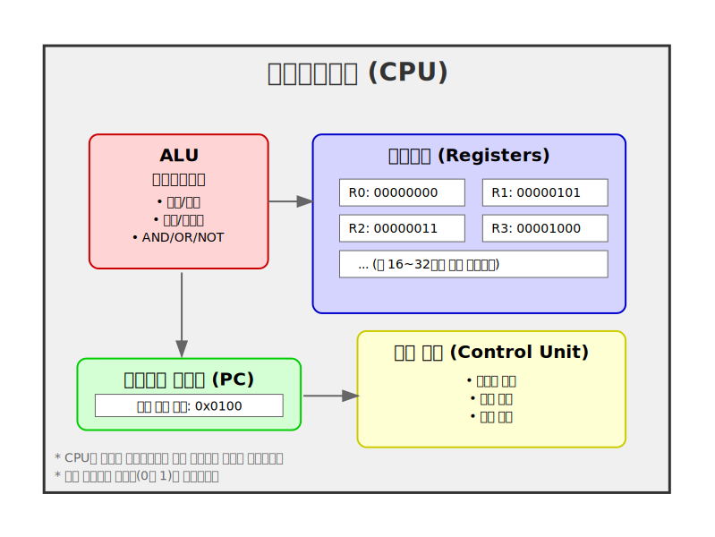
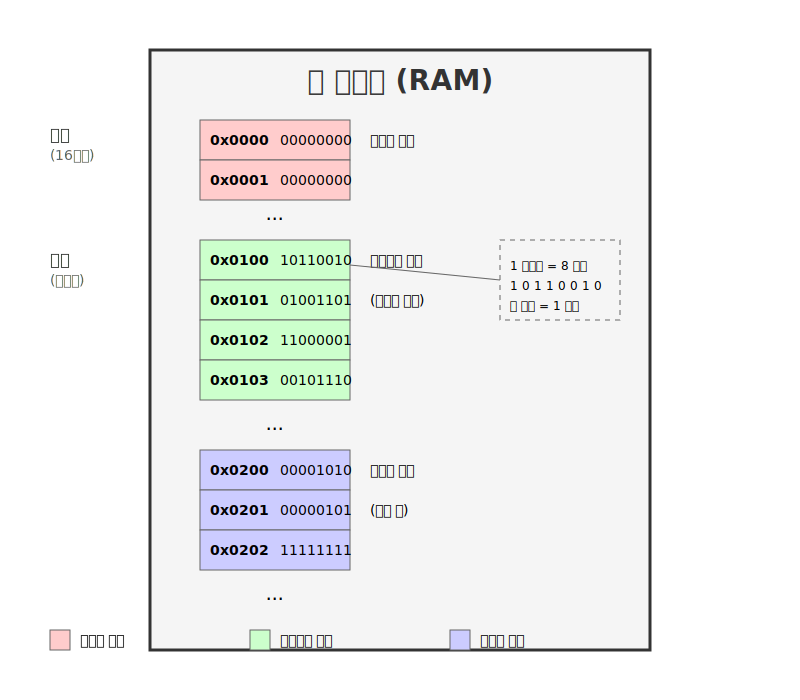
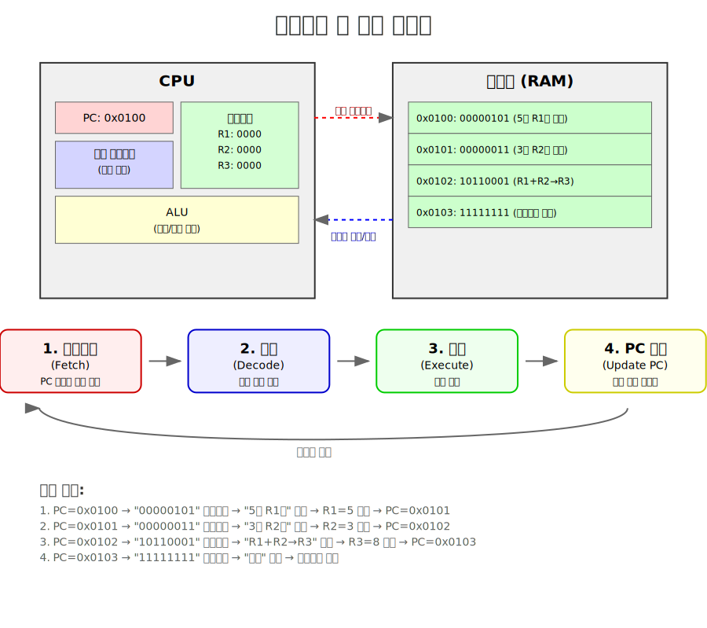

# 제1장 1절: 가져오기 및 실행 사이클 - 기계어

## 학습 목표
이 장을 학습한 후 여러분은 다음을 할 수 있게 됩니다:
- CPU의 기본 구조와 구성 요소를 이해합니다
- 메모리의 구조와 주소 체계를 설명할 수 있습니다
- 가져오기 및 실행 사이클의 작동 원리를 이해합니다
- 이진수와 기계어의 관계를 설명할 수 있습니다

## 1. 컴퓨터의 핵심 구성 요소

### 1.1 중앙처리장치(CPU)
컴퓨터의 두뇌에 해당하는 CPU는 모든 연산을 수행하는 핵심 부품입니다.

**CPU의 주요 구성 요소:**



### 1.2 주 메모리(RAM)
프로그램과 데이터를 저장하는 임시 저장 공간입니다.

**메모리 구조:**



```
주소     내용          설명
───────────────────────────────────
0x000   00000000     시스템 영역
0x001   00000000
...
0x100   10110010     프로그램 시작
0x101   01001101     (기계어 명령)
0x102   11000001
0x103   00101110
...
0x200   00001010     데이터 영역
0x201   00000101     (변수 값)
0x202   11111111
...
```

## 2. 가져오기 및 실행 사이클

### 2.1 사이클의 기본 개념
CPU는 끊임없이 다음 과정을 반복합니다:



### 2.2 단계별 상세 설명

**1단계: 가져오기 (Fetch)**
- PC가 가리키는 메모리 주소에서 명령을 읽어옵니다
- 명령은 CPU 내부로 복사됩니다

**2단계: 해독 (Decode)**
- 읽어온 이진수 패턴이 어떤 명령인지 해석합니다
- 필요한 데이터나 주소를 확인합니다

**3단계: 실행 (Execute)**
- 해독된 명령을 실제로 수행합니다
- 예: 두 수를 더하기, 데이터 이동하기 등

**4단계: PC 업데이트**
- 다음에 실행할 명령의 주소로 PC를 변경합니다
- 보통은 다음 순서의 명령이지만, 점프 명령의 경우 다른 주소로 변경될 수 있습니다

## 3. 이진수와 기계어

### 3.1 이진수 시스템
컴퓨터는 0과 1 두 가지 숫자만 사용하는 이진수 체계를 사용합니다.


**비트와 바이트:**
```
1 비트(bit) = 0 또는 1
1 바이트(byte) = 8 비트

예시:
10110010 = 1개의 바이트
│││││││└─ 2⁰ = 0
││││││└── 2¹ = 2
│││││└─── 2² = 0
││││└──── 2³ = 0
│││└───── 2⁴ = 16
││└────── 2⁵ = 32
│└─────── 2⁶ = 0
└──────── 2⁷ = 128
합계: 178 (10진수)
```

### 3.2 기계어 명령 구조
기계어 명령은 보통 여러 부분으로 구성됩니다:

```
예시: 두 레지스터의 값을 더하는 명령

[연산코드] [레지스터1] [레지스터2] [결과 레지스터]
 10110     010         011         001

의미: R2와 R3의 값을 더해서 R1에 저장하라
```

## 4. 실습 예제: 간단한 프로그램 실행 과정

### 예제 프로그램: 5 + 3 계산하기

**초기 상태:**
```
메모리:
주소  내용     의미
0x100 00000101 숫자 5를 R1에 로드
0x101 00000011 숫자 3을 R2에 로드
0x102 10110001 R1과 R2를 더해서 R3에 저장
0x103 11111111 프로그램 종료

PC: 0x100
레지스터: 모두 0
```

**실행 과정:**

**사이클 1:**
```
1. Fetch: PC(0x100)의 명령 읽기 → 00000101
2. Decode: "5를 R1에 로드하라"로 해석
3. Execute: R1 = 5
4. PC 업데이트: PC = 0x101

결과: R1 = 5, PC = 0x101
```

**사이클 2:**
```
1. Fetch: PC(0x101)의 명령 읽기 → 00000011
2. Decode: "3을 R2에 로드하라"로 해석
3. Execute: R2 = 3
4. PC 업데이트: PC = 0x102

결과: R1 = 5, R2 = 3, PC = 0x102
```

**사이클 3:**
```
1. Fetch: PC(0x102)의 명령 읽기 → 10110001
2. Decode: "R1과 R2를 더해서 R3에 저장하라"로 해석
3. Execute: R3 = R1 + R2 = 5 + 3 = 8
4. PC 업데이트: PC = 0x103

결과: R1 = 5, R2 = 3, R3 = 8, PC = 0x103
```

**사이클 4:**
```
1. Fetch: PC(0x103)의 명령 읽기 → 11111111
2. Decode: "프로그램 종료"로 해석
3. Execute: CPU 정지
```

## 5. 핵심 개념 정리

### 5.1 용어 정리
- **CPU (Central Processing Unit)**: 컴퓨터의 두뇌, 모든 연산 수행
- **ALU (Arithmetic Logic Unit)**: 산술 및 논리 연산 담당
- **레지스터 (Register)**: CPU 내부의 초고속 임시 저장소
- **프로그램 카운터 (PC)**: 다음 실행할 명령의 주소 저장
- **RAM (Random Access Memory)**: 프로그램과 데이터를 저장하는 주 메모리
- **기계어 (Machine Language)**: CPU가 직접 이해하는 이진수 명령
- **가져오기 및 실행 사이클**: CPU의 기본 작동 원리

### 5.2 중요 포인트
1. 컴퓨터는 기계어로 작성된 프로그램만 직접 실행할 수 있습니다
2. 모든 데이터와 명령은 이진수(0과 1)로 표현됩니다
3. CPU는 단순히 가져오기-실행 사이클을 반복할 뿐입니다
4. 각 명령은 매우 간단한 작업 하나만 수행합니다
5. 복잡한 프로그램도 이런 간단한 명령들의 조합입니다

## 6. 연습 문제

### 문제 1: 이진수 변환
다음 이진수를 10진수로 변환하세요:
- a) 10101010
- b) 11110000
- c) 00011111

### 문제 2: 가져오기 및 실행 사이클
다음 상황에서 CPU가 수행할 단계를 순서대로 나열하세요:
- PC = 0x200
- 메모리 0x200번지에는 "R1과 R2를 더하라"는 명령이 있음
- R1 = 10, R2 = 20

### 문제 3: 개념 이해
다음 설명이 맞으면 O, 틀리면 X를 표시하세요:
- a) CPU는 프로그램의 의미를 이해하고 실행한다 ( )
- b) 프로그램 카운터는 다음 실행할 명령의 주소를 저장한다 ( )
- c) 1바이트는 16비트로 구성된다 ( )
- d) 기계어는 0과 1로만 구성된다 ( )

## 7. 심화 학습 자료

### 추가 읽기 자료
- 컴퓨터 구조의 기초
- 디지털 논리 회로의 이해
- 어셈블리 언어 입문

### 관련 학습 자료
- [추가 예제 및 연습문제](lesson_1_1_examples.md)
- [빠른 참조 가이드](lesson_1_1_reference.md)

### 다음 학습 내용
- 1.2절: 비동기 이벤트 - 인터럽트
- 고급 프로그래밍 언어의 필요성
- 자바 언어의 특징과 장점

---

**학습 팁:**
1. 이진수 계산은 처음에는 어려울 수 있지만, 연습하면 쉬워집니다
2. CPU의 작동 원리를 완전히 이해하려고 하지 마세요. 기본 개념만 파악하면 충분합니다
3. 실제 프로그래밍에서는 기계어를 직접 다루지 않으므로 걱정하지 마세요