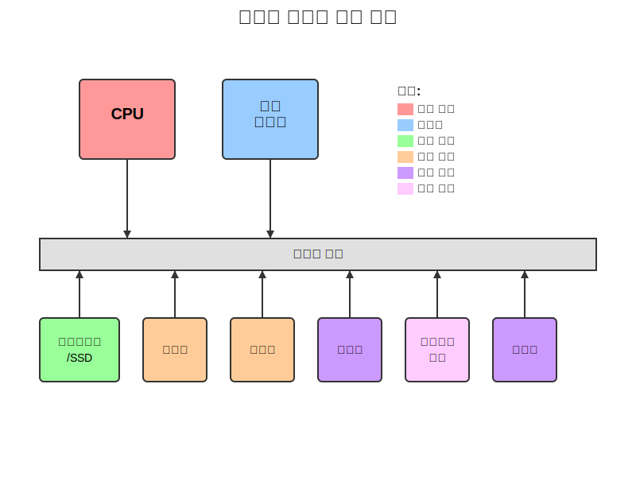
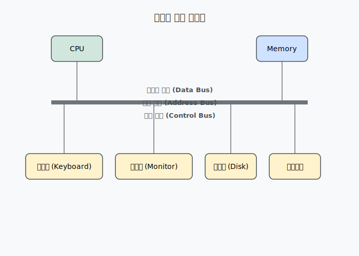
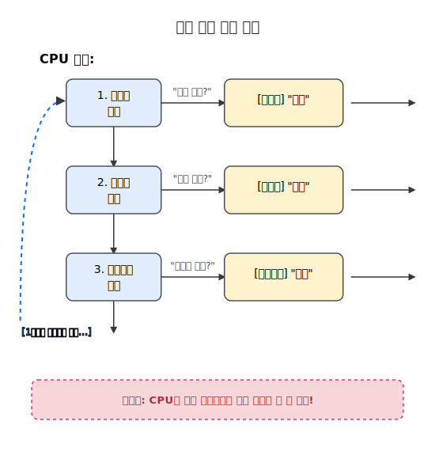
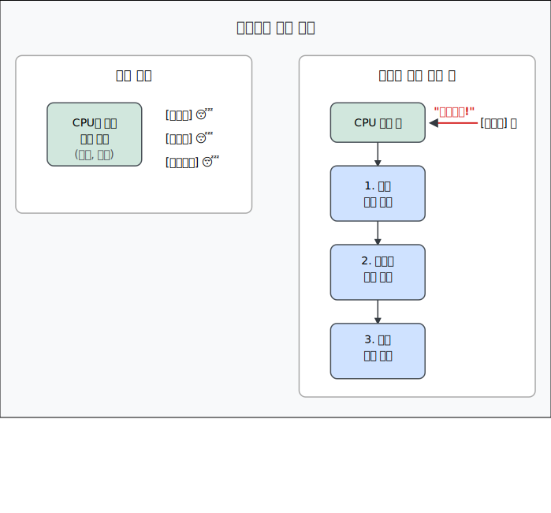
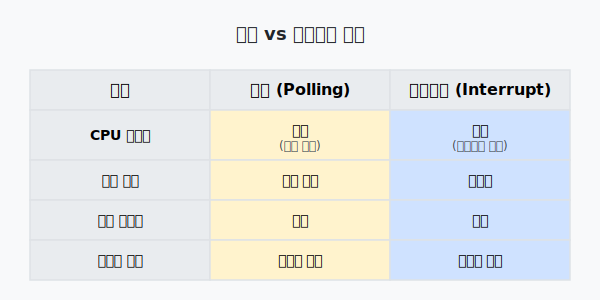
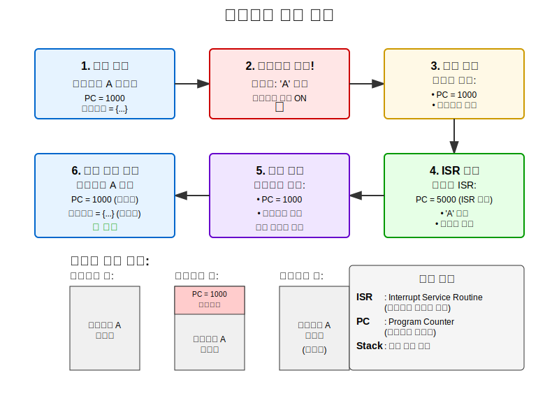
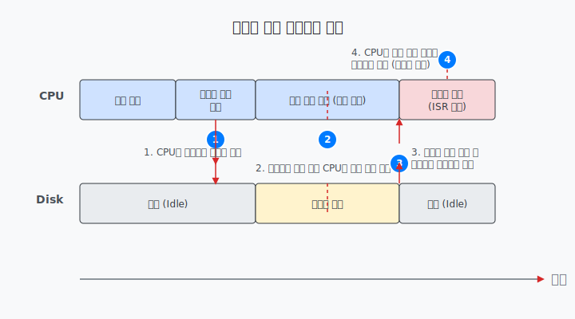
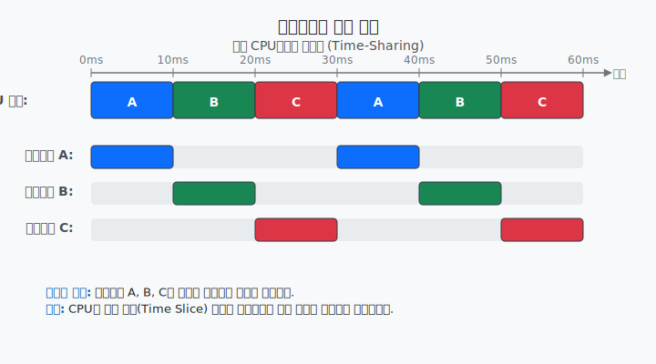
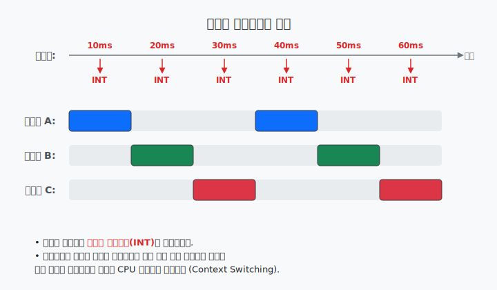
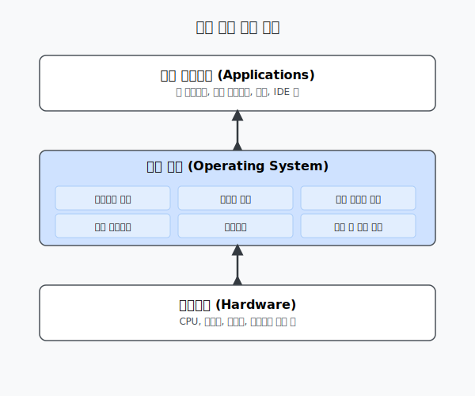

# 1.2 비동기 이벤트: 폴링 루프와 인터럽트 - 학습 자료

## 학습 목표
이 섹션을 학습한 후, 여러분은 다음을 할 수 있게 됩니다:
- 컴퓨터 시스템의 다양한 구성 요소와 그들의 역할을 설명할 수 있습니다
- 장치 드라이버의 개념을 이해할 수 있습니다
- 폴링과 인터럽트의 차이점을 설명할 수 있습니다
- 인터럽트 처리 메커니즘을 이해할 수 있습니다
- 멀티태스킹과 스레드의 개념을 설명할 수 있습니다
- 운영 체제의 역할을 이해할 수 있습니다

---

## 1. 컴퓨터 시스템의 구성 요소

### 1.1 기본 구성 요소

컴퓨터는 CPU와 메모리만으로는 완전하지 않습니다. 실제 컴퓨터 시스템에는 다음과 같은 다양한 장치들이 포함됩니다:



### 1.2 각 구성 요소의 역할

| 구성 요소          | 주요 역할        | 특징                                                                               |
| ------------------ | ---------------- | ---------------------------------------------------------------------------------- |
| **하드디스크/SSD** | 영구 저장 장치   | • 전원이 꺼져도 데이터 유지<br>• 대용량 저장 가능<br>• SSD는 HDD보다 빠르지만 비쌈 |
| **키보드**         | 텍스트 입력 장치 | • 사용자의 타이핑을 전기 신호로 변환<br>• 각 키마다 고유한 코드 생성               |
| **마우스**         | 포인팅 입력 장치 | • 움직임과 클릭을 좌표로 변환<br>• GUI 환경에서 필수적                             |
| **모니터**         | 시각적 출력 장치 | • 이진 데이터를 픽셀로 변환하여 표시<br>• 해상도와 재생률이 중요                   |
| **네트워크 카드**  | 통신 장치        | • 다른 컴퓨터와 데이터 교환<br>• 인터넷 연결 담당                                  |

### 1.3 장치 드라이버 (Device Driver)

```
┌──────────────────────────────────────────────────────────┐
│                    Role of Device Driver                 │
├──────────────────────────────────────────────────────────┤
│                                                          │
│   Application       "Please save the file"               │
│        ↓                                                 │
│   Operating System  "I need to write data to hard disk"  │
│        ↓                                                 │
│   Device Driver     "This hard disk model requires..."   │
│        ↓                                                 │
│   Hardware Device   [Actually performs data storage]     │
│                                                          │
└──────────────────────────────────────────────────────────┘
```

**장치 드라이버란?**
- CPU가 특정 하드웨어 장치와 통신할 수 있게 해주는 소프트웨어
- 각 장치마다 고유한 드라이버가 필요
- 운영 체제와 하드웨어 사이의 번역기 역할

---

## 2. 버스 아키텍처

### 2.1 버스 시스템의 구조



### 2.2 버스의 종류

| 버스 종류       | 역할                 | 예시                          |
| --------------- | -------------------- | ----------------------------- |
| **데이터 버스** | 실제 데이터 전송     | 파일 내용, 계산 결과          |
| **주소 버스**   | 데이터의 목적지 지정 | 메모리 주소, 장치 번호        |
| **제어 버스**   | 동작 제어 신호 전송  | 읽기/쓰기 신호, 인터럽트 신호 |

---

## 3. 폴링 vs 인터럽트

### 3.1 폴링 (Polling) 방식



### 3.2 인터럽트 (Interrupt) 방식



### 3.3 폴링 vs 인터럽트 비교



---

## 4. 인터럽트 처리 과정

### 4.1 상세한 인터럽트 처리 흐름



### 4.2 실제 예시: 디스크 읽기



**설명**
1. CPU가 디스크에 데이터를 요청합니다.
2. CPU는 기다리지 않고 다른 작업을 수행합니다.
3. 디스크가 데이터 준비 완료 시 인터럽트를 발생시킵니다.
4. CPU가 인터럽트를 처리하고 데이터를 받습니다.

효율성: CPU는 디스크를 기다리는 대신 다른 작업을 할 수 있습니다!
---

## 5. 멀티태스킹과 스레드

### 5.1 멀티태스킹의 개념



### 5.2 스레드 상태 변화


**참고**
* [Life Cycle of a Thread in Java](https://www.baeldung.com/java-thread-lifecycle)

### 5.3 선점형 멀티태스킹



**특징**

- 스레드가 자발적으로 양보하지 않아도 됨
- 타이머가 강제로 CPU 사용권을 전환
- 모든 스레드가 공평하게 실행 기회를 얻음
- 현대 운영체제의 표준 방식

**참고**

- [Preemptive and Non-Preemptive Scheduling](https://www.geeksforgeeks.org/operating-systems/preemptive-and-non-preemptive-scheduling/)
- [Difference Between Preemptive and Non-Preemptive CPU Scheduling Algorithms](https://www.geeksforgeeks.org/operating-systems/difference-between-preemptive-and-non-preemptive-cpu-scheduling-algorithms/)

---

## 6. 운영 체제의 역할

### 6.1 운영 체제 계층 구조



### 6.2 운영 체제의 주요 기능

| 기능                  | 설명                     | 예시                 |
| --------------------- | ------------------------ | -------------------- |
| **프로세스 관리**     | 프로그램 실행과 스케줄링 | 멀티태스킹, CPU 할당 |
| **메모리 관리**       | 메모리 할당과 보호       | 가상 메모리, 페이징  |
| **파일 시스템**       | 파일 저장과 구성         | 디렉토리, 파일 권한  |
| **장치 관리**         | 하드웨어 장치 제어       | 드라이버 관리        |
| **사용자 인터페이스** | 사용자와 상호작용        | GUI, 명령줄          |

---

## 실습 예제

### 예제 1: 폴링 시뮬레이션 (의사코드)

```java
// 폴링 방식의 키보드 입력 처리 (비효율적)
while (true) {
    // CPU가 계속 확인
    if (키보드.hasInput()) {
        char key = 키보드.readKey();
        System.out.println("입력된 키: " + key);
    }
    if (마우스.hasClick()) {
        Point position = 마우스.getPosition();
        System.out.println("클릭 위치: " + position);
    }
    if (네트워크.hasData()) {
        byte[] data = 네트워크.readData();
        processData(data);
    }
    // CPU는 입력이 없어도 계속 확인하느라 바쁨!
}
```

### 예제 2: 인터럽트 방식 (개념적 설명)

```java
// 인터럽트 방식 (효율적)
// 메인 프로그램
public void mainProgram() {
    while (true) {
        // CPU는 유용한 작업 수행
        계산수행();
        데이터처리();
        화면갱신();
        // 인터럽트가 발생하면 자동으로 처리됨
    }
}

// 키보드 인터럽트 처리기 (자동으로 호출됨)
@InterruptHandler
public void onKeyboardInterrupt() {
    char key = 키보드.readKey();
    키버퍼.add(key);
    // 처리 완료 후 메인 프로그램으로 자동 복귀
}

// 타이머 인터럽트 처리기 (10ms마다 자동 호출)
@InterruptHandler
public void onTimerInterrupt() {
    현재스레드 = 스케줄러.getNextThread();
    컨텍스트전환(현재스레드);
}
```

---

## 연습 문제

### 1. 개념 이해 문제

1. **폴링과 인터럽트의 차이점을 설명하세요.**
   - 힌트: CPU 효율성, 응답 시간, 구현 복잡도를 고려하세요.

2. **장치 드라이버가 필요한 이유는 무엇인가요?**
   - 힌트: CPU와 다양한 하드웨어 장치 간의 통신을 생각해보세요.

3. **멀티태스킹이 단일 CPU에서 어떻게 가능한가요?**
   - 힌트: 시분할과 컨텍스트 스위칭을 고려하세요.

### 2. 응용 문제

1. **다음 상황에서 폴링과 인터럽트 중 어느 것이 더 적합할까요?**
   - a) 게임에서 키보드 입력 처리
   - b) 온도 센서 모니터링 (1초에 1번 확인)
   - c) 네트워크 패킷 수신
   - d) 실시간 주식 가격 업데이트

2. **스레드가 "대기중" 상태가 되는 경우를 3가지 이상 제시하세요.**

3. **운영 체제가 없다면 어떤 문제가 발생할까요?**

### 3. 실습 과제

1. **인터럽트 처리 과정 다이어그램 그리기**
   - 키보드에서 'Hello'를 입력할 때의 인터럽트 처리 과정을 단계별로 그려보세요.

2. **멀티태스킹 시뮬레이션**
   - 3개의 프로그램이 10ms씩 번갈아 실행되는 타임라인을 그려보세요.
   - 각 프로그램의 총 실행 시간이 30ms일 때, 전체 완료 시간은?

---

## 심화 학습 자료

### 더 알아보기
- 실시간 운영 체제(RTOS)와 일반 운영 체제의 차이
- 다중 코어 CPU에서의 진정한 병렬 처리
- 인터럽트 우선순위와 중첩 인터럽트
- 가상화 기술과 하이퍼바이저

### 관련 용어 정리
- **ISR (Interrupt Service Routine)**: 인터럽트 서비스 루틴
- **Context Switching**: 컨텍스트 전환
- **Preemptive Multitasking**: 선점형 멀티태스킹
- **Time Slice**: 타임 슬라이스 (각 스레드에 할당된 실행 시간)
- **Device Driver**: 장치 드라이버
- **System Bus**: 시스템 버스

---

## 요약

이 섹션에서 우리는 다음을 배웠습니다:

1. **컴퓨터 시스템은 다양한 구성 요소로 이루어져 있으며**, 각각은 시스템 버스를 통해 연결됩니다.

2. **장치 드라이버는 하드웨어와 소프트웨어를 연결하는** 중요한 역할을 합니다.

3. **인터럽트는 폴링보다 효율적인** 비동기 이벤트 처리 방법입니다.

4. **멀티태스킹은 시분할을 통해** 여러 프로그램이 동시에 실행되는 것처럼 보이게 합니다.

5. **운영 체제는 이 모든 것을 관리하는** 핵심 소프트웨어입니다.

다음 섹션에서는 자바 프로그래밍 언어에 대해 본격적으로 알아보겠습니다!