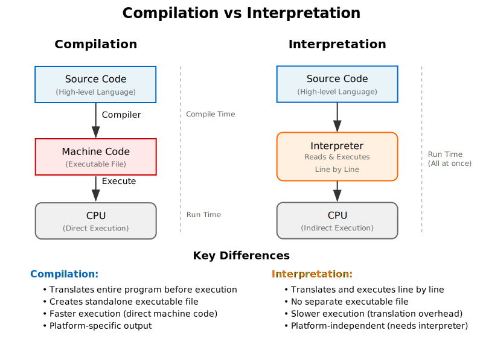
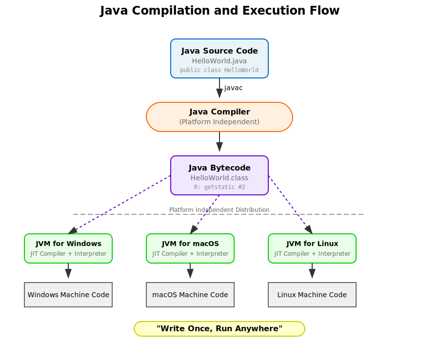
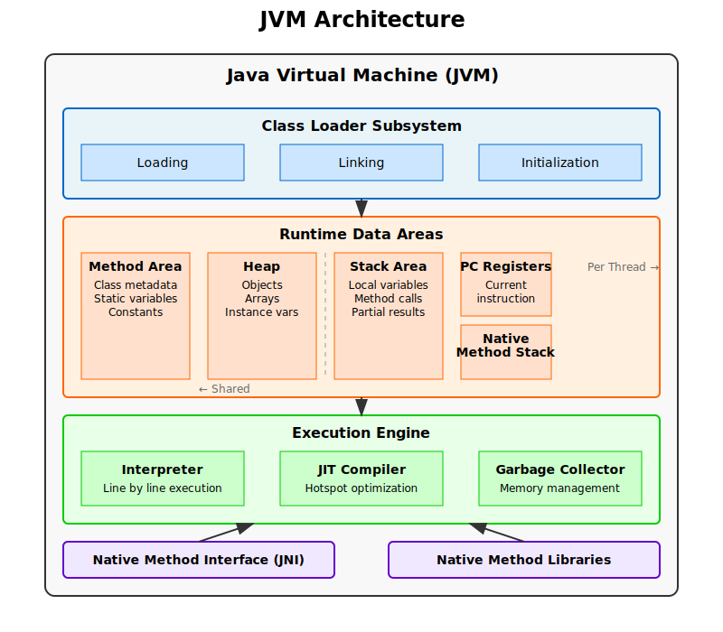
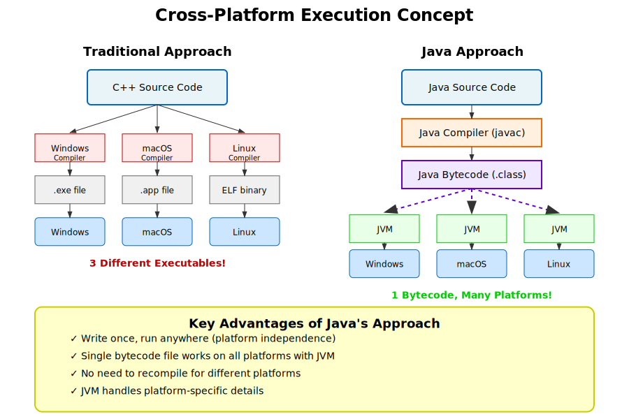
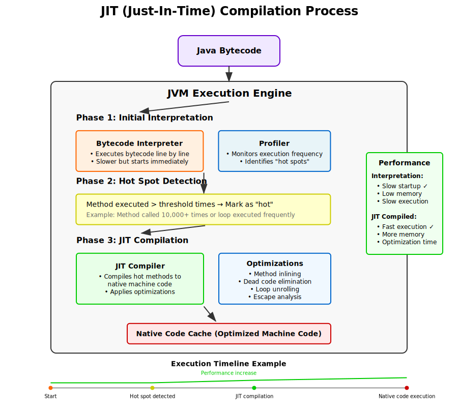

# 1.3 자바 가상 머신 (Java Virtual Machine) - 상세 학습 자료

## 학습 목표
- 고급 언어와 기계어의 차이점 이해
- 컴파일러와 인터프리터의 작동 방식 이해
- Java의 하이브리드 접근 방식과 플랫폼 독립성 이해
- JVM의 구조와 작동 원리 이해
- JIT 컴파일의 개념과 성능 향상 원리 이해

---

## 1. 프로그래밍 언어의 계층 구조

### 1.1 기계어 (Machine Language)
- **정의**: CPU가 직접 이해하고 실행할 수 있는 이진 코드 (0과 1의 조합)
- **특징**:
  - 각 CPU 아키텍처마다 고유한 기계어 명령어 세트 보유
  - 인간이 읽고 쓰기 매우 어려움
  - 가장 빠른 실행 속도

**예시**:
```
10110000 01100001  (x86: MOV AL, 97)
```

### 1.2 어셈블리어 (Assembly Language)
- **정의**: 기계어와 1:1 대응되는 니모닉(mnemonic) 코드
- **특징**:
  - 기계어보다는 읽기 쉽지만 여전히 저수준
  - 플랫폼 의존적

**예시**:
```assembly
MOV AL, 97    ; AL 레지스터에 97을 저장
ADD BX, CX    ; BX와 CX를 더하여 BX에 저장
```

### 1.3 고급 프로그래밍 언어 (High-level Languages)
- **정의**: 인간이 이해하기 쉬운 구문으로 작성되는 언어
- **특징**:
  - 플랫폼 독립적인 소스 코드
  - 추상화 수준이 높음
  - 생산성이 높음

**예시들**:
- Java, Python, C++, JavaScript, Ruby, Go 등

---

## 2. 컴파일러 vs 인터프리터



### 2.1 컴파일러 (Compiler)

**작동 방식**:
1. 전체 소스 코드를 한 번에 읽음
2. 문법 분석 및 의미 분석 수행
3. 최적화 과정 거침
4. 타겟 플랫폼의 기계어로 번역
5. 실행 가능한 파일 생성

**장점**:
- 실행 속도가 빠름 (이미 기계어로 번역됨)
- 소스 코드 없이 배포 가능
- 컴파일 시점에 많은 오류 발견 가능

**단점**:
- 플랫폼마다 다시 컴파일 필요
- 컴파일 시간이 소요됨
- 수정 시 전체 재컴파일 필요할 수 있음

**예시 언어**: C, C++, Rust, Go

### 2.2 인터프리터 (Interpreter)

**작동 방식**:
1. 소스 코드를 한 줄씩 읽음
2. 각 줄을 즉시 해석하고 실행
3. 필요시 기계어 명령어 생성 및 실행
4. 다음 줄로 이동

**장점**:
- 플랫폼 독립적 (인터프리터만 있으면 됨)
- 즉시 실행 가능
- 대화형 개발 환경 제공 가능
- 동적인 코드 실행 가능

**단점**:
- 실행 속도가 느림 (매번 해석 필요)
- 실행 시 소스 코드 필요
- 런타임 오류 발생 가능성

**예시 언어**: Python, Ruby, JavaScript (초기)

---

## 3. Java의 하이브리드 접근 방식



### 3.1 Java의 독특한 전략

Java는 컴파일러와 인터프리터의 장점을 결합한 하이브리드 방식을 채택:

1. **컴파일 단계**: Java 소스 코드 → Java 바이트코드
2. **실행 단계**: Java 바이트코드 → JVM에서 해석/실행

### 3.2 Java 바이트코드 (Bytecode)

**정의**: JVM이 이해할 수 있는 중간 수준의 명령어 세트

**특징**:
- 플랫폼 독립적
- 스택 기반 명령어
- 클래스 파일(.class)에 저장
- 실제 기계어보다 추상화 수준이 높음


**바이트코드 예시**:
```java
// Java 소스 코드
public class Hello {
    public static void main(String[] args) {
        System.out.println("Hello, World!");
    }
}

// 컴파일된 바이트코드 (일부)
0: getstatic     #2  // Field java/lang/System.out
3: ldc           #3  // String "Hello, World!"
5: invokevirtual #4  // Method java/io/PrintStream.println
8: return
```

**참고**:
- [Java 바이트코드 특징](./java_바이트코드_특징.md)
- [Java 바이트코드 예제](./java_바이트코드_예제.md)

### 3.3 컴파일 과정

```bash
# Java 소스 파일 컴파일
javac Hello.java

# 결과: Hello.class 파일 생성 (바이트코드 포함)
```

---

## 4. Java Virtual Machine (JVM)



### 4.1 JVM의 정의와 역할

**정의**: Java 바이트코드를 실행하는 가상의 컴퓨터

**주요 역할**:
1. 바이트코드 해석 및 실행
2. 메모리 관리
3. 보안 제공
4. 플랫폼별 차이 추상화

### 4.2 JVM 구성 요소

#### 4.2.1 클래스 로더 (Class Loader)
- **역할**: .class 파일을 메모리에 로드
- **과정**:
  1. Loading: 클래스 파일 찾기 및 읽기
  2. Linking: 검증, 준비, 해석
  3. Initialization: 정적 변수 초기화

#### 4.2.2 런타임 데이터 영역 (Runtime Data Areas)

**공유 영역** (모든 스레드가 공유):
- **메서드 영역**: 클래스 메타데이터, 정적 변수, 상수
- **힙**: 객체와 배열 저장

**스레드별 영역** (각 스레드마다 독립적):
- **스택**: 지역 변수, 메서드 호출 정보
- **PC 레지스터**: 현재 실행 중인 명령어 주소
- **네이티브 메서드 스택**: 네이티브 메서드 실행용

#### 4.2.3 실행 엔진 (Execution Engine)
- **인터프리터**: 바이트코드를 한 줄씩 해석 및 실행
- **JIT 컴파일러**: 자주 사용되는 코드를 기계어로 컴파일
- **가비지 컬렉터**: 사용하지 않는 메모리 자동 해제

---

## 5. 플랫폼 독립성



### 5.1 "Write Once, Run Anywhere"

Java의 핵심 철학으로, 한 번 작성한 코드가 JVM이 설치된 모든 플랫폼에서 실행 가능

### 5.2 플랫폼 독립성의 구현

1. **소스 코드 레벨**: 플랫폼 특정 기능 추상화
2. **바이트코드 레벨**: 중간 표현으로 플랫폼 중립성 확보
3. **JVM 레벨**: 각 플랫폼별 JVM이 플랫폼 특정 처리

### 5.3 장점

- **개발 효율성**: 여러 플랫폼용으로 별도 개발 불필요
- **배포 용이성**: 하나의 JAR/WAR 파일로 배포
- **유지보수**: 한 버전만 관리
- **비용 절감**: 개발 및 테스트 비용 감소

---

## 6. JIT (Just-In-Time) 컴파일



### 6.1 JIT 컴파일러의 필요성

초기 Java는 순수 인터프리터 방식으로 인해 성능이 느렸음. JIT 컴파일러는 이를 해결하기 위해 도입됨.

### 6.2 작동 원리

1. **프로파일링**: 코드 실행 패턴 모니터링
2. **핫스팟 감지**: 자주 실행되는 코드 식별
3. **최적화 컴파일**: 핫스팟을 네이티브 코드로 컴파일
4. **코드 캐싱**: 컴파일된 코드 저장 및 재사용

### 6.3 최적화 기법

- **메서드 인라이닝**: 작은 메서드를 호출 위치에 직접 삽입
- **데드 코드 제거**: 실행되지 않는 코드 제거
- **루프 언롤링**: 반복문 최적화
- **이스케이프 분석**: 객체 할당 최적화

### 6.4 성능 향상

```
초기 실행: 인터프리터 (느림)
     ↓
핫스팟 감지
     ↓
JIT 컴파일
     ↓
최적화된 네이티브 코드 실행 (빠름)
```

---

## 7. JVM 언어 생태계

### 7.1 JVM을 타겟으로 하는 다른 언어들

JVM은 Java뿐만 아니라 다양한 언어의 실행 플랫폼으로 발전:

- **Kotlin**: 현대적인 문법, Android 공식 언어
- **Scala**: 함수형 프로그래밍 + 객체지향
- **Groovy**: 동적 타이핑, 스크립팅
- **Clojure**: Lisp 계열, 함수형 프로그래밍
- **Jython**: Python의 JVM 구현
- **JRuby**: Ruby의 JVM 구현

### 7.2 장점

- Java 라이브러리 재사용 가능
- JVM의 성능 최적화 혜택
- 플랫폼 독립성 상속
- 기존 Java 인프라 활용

---

## 8. 실습 예제

### 8.1 간단한 Java 프로그램 작성 및 컴파일

```java
// HelloWorld.java
public class HelloWorld {
    public static void main(String[] args) {
        System.out.println("안녕하세요, Java!");

        // 플랫폼 정보 출력
        System.out.println("OS: " + System.getProperty("os.name"));
        System.out.println("Java Version: " + System.getProperty("java.version"));
        System.out.println("JVM Vendor: " + System.getProperty("java.vendor"));
    }
}
```

### 8.2 컴파일 및 실행

```bash
# 컴파일
javac HelloWorld.java

# 바이트코드 확인
javap -c HelloWorld

# 실행
java HelloWorld
```

### 8.3 바이트코드 분석

```bash
# javap -c HelloWorld 출력 예시
public class HelloWorld {
  public HelloWorld();
    Code:
       0: aload_0
       1: invokespecial #1  // Method java/lang/Object."<init>":()V
       4: return

  public static void main(java.lang.String[]);
    Code:
       0: getstatic     #2  // Field java/lang/System.out
       3: ldc           #3  // String 안녕하세요, Java!
       5: invokevirtual #4  // Method java/io/PrintStream.println
       8: return
}
```

---

## 9. 연습 문제

### 문제 1: 개념 이해
다음 중 Java의 플랫폼 독립성을 가능하게 하는 핵심 요소는?
a) Java 소스 코드
b) Java 바이트코드
c) JDK
d) IDE

### 문제 2: 컴파일러 vs 인터프리터
C++과 Python의 실행 방식을 비교하고, Java가 두 방식을 어떻게 결합했는지 설명하세요.

### 문제 3: JVM 구성 요소
JVM의 메모리 영역 중 객체가 저장되는 곳은? 그리고 지역 변수가 저장되는 곳은?

### 문제 4: JIT 컴파일
JIT 컴파일러가 성능을 향상시키는 원리를 설명하세요.

### 문제 5: 실습
1. 간단한 Java 프로그램을 작성하고 컴파일하세요.
2. 생성된 .class 파일의 크기를 확인하세요.
3. 다른 운영체제에서도 같은 .class 파일이 실행되는지 확인하세요.

---

## 10. 심화 학습 주제

1. **JVM 튜닝**: 힙 크기, GC 알고리즘 선택
2. **클래스 로딩 메커니즘**: 부트스트랩, 확장, 시스템 클래스 로더
3. **JVM 명령줄 옵션**: -Xmx, -Xms, -XX 옵션들
4. **프로파일링 도구**: JVisualVM, JProfiler
5. **GraalVM**: 차세대 고성능 JVM

---

## 요약

Java Virtual Machine은 Java의 핵심 기술로, 플랫폼 독립성과 높은 성능을 동시에 제공합니다. 컴파일과 인터프리테이션을 결합한 하이브리드 접근 방식을 통해 "Write Once, Run Anywhere"를 실현하며, JIT 컴파일러를 통해 성능 문제를 해결했습니다. JVM은 이제 Java뿐만 아니라 다양한 언어의 실행 플랫폼으로 발전하여 풍부한 생태계를 형성하고 있습니다.