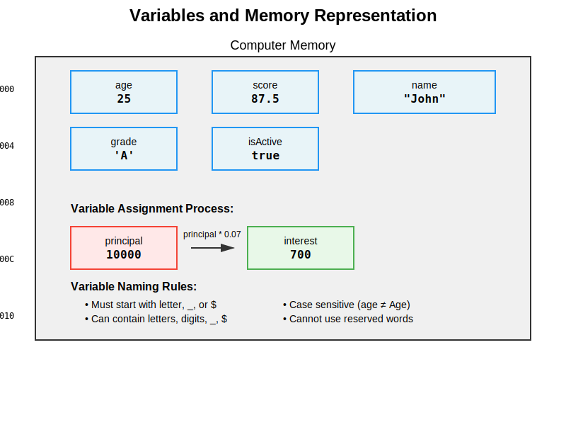
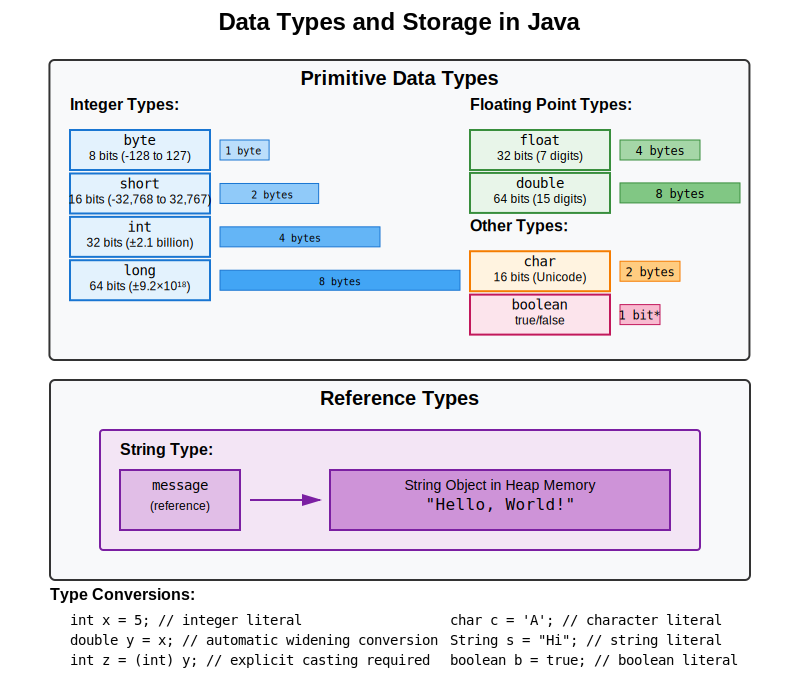
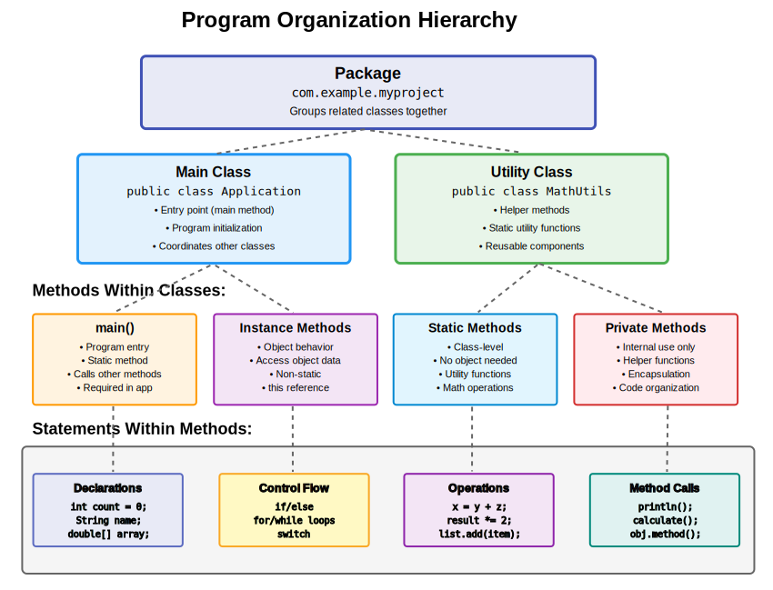

# 1.4장: 프로그램의 기본 구성 요소 - 상세 학습 자료

## 학습 목표
이 장을 학습한 후, 여러분은 다음을 할 수 있게 됩니다:
- 변수의 개념과 메모리에서의 역할을 이해합니다
- Java의 기본 데이터 타입과 저장 방식을 파악합니다
- 제어 구조를 사용하여 프로그램의 흐름을 제어합니다
- 서브루틴(메소드)을 이해하고 활용합니다
- 프로그램의 계층적 구조를 이해합니다

## 1. 변수와 메모리 표현

### 1.1 변수란 무엇인가?

변수는 프로그램에서 데이터를 저장하는 이름이 지정된 메모리 공간입니다. 마치 라벨이 붙은 상자와 같아서, 우리는 상자의 이름(변수명)을 통해 내용물(데이터)에 접근할 수 있습니다.



### 1.2 변수의 핵심 개념

#### 변수 선언과 초기화
```java
// 변수 선언
int age;           // 정수를 저장할 공간 확보
String name;       // 문자열을 저장할 공간 확보

// 변수 초기화 (값 할당)
age = 25;          // age 변수에 25 저장
name = "홍길동";    // name 변수에 "홍길동" 저장

// 선언과 동시에 초기화
double score = 87.5;  // 실수형 변수 선언과 초기화
boolean isActive = true;  // 불린형 변수 선언과 초기화
```

#### 변수 명명 규칙
1. **필수 규칙**:
   - 문자, 밑줄(_), 달러 기호($)로 시작해야 함
   - 두 번째 문자부터는 숫자도 사용 가능
   - 대소문자를 구분함 (age와 Age는 다른 변수)
   - Java 예약어는 사용할 수 없음 (int, class, public 등)

2. **권장 사항**:
   - 의미 있는 이름 사용 (a, b 대신 age, score)
   - camelCase 사용 (studentName, totalScore)
   - 상수는 대문자와 밑줄 사용 (MAX_VALUE, PI)

### 1.3 변수의 범위 (Scope)

```java
public class ScopeExample {
    // 클래스 레벨 변수 (인스턴스 변수)
    private int classVariable = 10;

    public void method1() {
        // 메소드 레벨 변수 (지역 변수)
        int methodVariable = 20;

        if (methodVariable > 15) {
            // 블록 레벨 변수
            int blockVariable = 30;
            System.out.println(blockVariable); // OK
        }
        // System.out.println(blockVariable); // 에러! 블록 밖에서는 접근 불가
    }
}
```

## 2. 데이터 타입과 저장 방식

### 2.1 기본 데이터 타입 (Primitive Types)

Java는 8개의 기본 데이터 타입을 제공합니다:



#### 정수형 타입
```java
// byte: -128 ~ 127 (1바이트)
byte smallNumber = 100;

// short: -32,768 ~ 32,767 (2바이트)
short mediumNumber = 30000;

// int: 약 -21억 ~ 21억 (4바이트) - 가장 자주 사용
int commonNumber = 1234567890;

// long: 매우 큰 정수 (8바이트)
long bigNumber = 9876543210L;  // L 또는 l 접미사 필요
```

#### 실수형 타입
```java
// float: 소수점 7자리 정밀도 (4바이트)
float price = 19.99f;  // f 또는 F 접미사 필요

// double: 소수점 15자리 정밀도 (8바이트) - 기본 실수형
double pi = 3.141592653589793;
double scientificNotation = 1.23e-4; // 0.000123
```

#### 문자와 불린 타입
```java
// char: 단일 문자 (유니코드, 2바이트)
char grade = 'A';
char koreanChar = '가';
char unicodeChar = '\u0041'; // 'A'의 유니코드

// boolean: 참/거짓 (크기는 JVM에 따라 다름)
boolean isStudent = true;
boolean hasGraduated = false;
```

### 2.2 참조 타입 (Reference Types)

참조 타입은 객체의 메모리 주소를 저장합니다:

```java
// String: 문자열 (참조 타입)
String message = "Hello, World!";
String emptyString = "";
String nullString = null; // 아무것도 참조하지 않음

// 배열: 동일한 타입의 여러 값 저장
int[] numbers = {1, 2, 3, 4, 5};
String[] names = new String[10]; // 10개 요소를 가진 배열

// 객체: 사용자 정의 타입
Student student = new Student("홍길동", 20);
```

### 2.3 타입 변환

#### 자동 타입 변환 (묵시적 변환)
```java
// 작은 타입에서 큰 타입으로 자동 변환
byte b = 10;
short s = b;    // byte → short (자동)
int i = s;      // short → int (자동)
long l = i;     // int → long (자동)
float f = l;    // long → float (자동)
double d = f;   // float → double (자동)
```

#### 강제 타입 변환 (명시적 변환)
```java
// 큰 타입에서 작은 타입으로 변환 시 캐스팅 필요
double d = 3.14;
int i = (int) d;        // 3 (소수점 이하 버림)

int x = 130;
byte b = (byte) x;      // -126 (오버플로우 발생)

// 문자열과 숫자 간 변환
String str = "123";
int num = Integer.parseInt(str);       // 문자열 → 정수
double dbl = Double.parseDouble("3.14"); // 문자열 → 실수

String numStr = String.valueOf(456);   // 숫자 → 문자열
```

## 3. 기본 연산과 표현식

### 3.1 산술 연산자
```java
int a = 10, b = 3;
int sum = a + b;        // 13 (덧셈)
int diff = a - b;       // 7 (뺄셈)
int product = a * b;    // 30 (곱셈)
int quotient = a / b;   // 3 (정수 나눗셈)
int remainder = a % b;  // 1 (나머지)

double x = 10.0, y = 3.0;
double division = x / y; // 3.333... (실수 나눗셈)
```

### 3.2 할당 연산자
```java
int value = 10;
value += 5;  // value = value + 5; (15)
value -= 3;  // value = value - 3; (12)
value *= 2;  // value = value * 2; (24)
value /= 4;  // value = value / 4; (6)
value %= 4;  // value = value % 4; (2)
```

### 3.3 증감 연산자
```java
int count = 5;
count++;     // 후위 증가: count = 6
++count;     // 전위 증가: count = 7

int a = 5;
int b = a++; // b = 5, a = 6 (사용 후 증가)
int c = ++a; // c = 7, a = 7 (증가 후 사용)
```

## 4. 제어 구조 (Control Structures)

프로그램의 실행 흐름을 제어하는 구조들입니다:


### 4.1 조건문 (분기문)

#### if-else 문
```java
// 기본 if 문
int age = 18;
if (age >= 18) {
    System.out.println("성인입니다.");
}

// if-else 문
double score = 75.5;
if (score >= 90) {
    System.out.println("A 학점");
} else if (score >= 80) {
    System.out.println("B 학점");
} else if (score >= 70) {
    System.out.println("C 학점");
} else {
    System.out.println("재수강 필요");
}

// 중첩 if 문
int income = 50000000;
boolean hasHouse = true;

if (income > 40000000) {
    if (hasHouse) {
        System.out.println("주택 담보 대출 가능");
    } else {
        System.out.println("신용 대출 가능");
    }
}
```

#### switch 문
```java
int dayNumber = 3;
String dayName;

switch (dayNumber) {
    case 1:
        dayName = "월요일";
        break;
    case 2:
        dayName = "화요일";
        break;
    case 3:
        dayName = "수요일";
        break;
    case 4:
        dayName = "목요일";
        break;
    case 5:
        dayName = "금요일";
        break;
    case 6:
    case 7:  // 여러 case를 함께 처리
        dayName = "주말";
        break;
    default:
        dayName = "잘못된 요일";
}

// Java 14+ 향상된 switch 표현식
String dayType = switch (dayNumber) {
    case 1, 2, 3, 4, 5 -> "평일";
    case 6, 7 -> "주말";
    default -> "잘못된 요일";
};
```

### 4.2 반복문 (Loops)

#### while 문
```java
// 기본 while 문
int count = 0;
while (count < 5) {
    System.out.println("카운트: " + count);
    count++;
}

// 무한 루프와 break
Scanner scanner = new Scanner(System.in);
while (true) {
    System.out.print("숫자를 입력하세요 (0: 종료): ");
    int num = scanner.nextInt();
    if (num == 0) {
        break;  // 루프 종료
    }
    System.out.println("입력한 숫자: " + num);
}
```

#### do-while 문
```java
// 최소 한 번은 실행
int attempts = 0;
boolean success = false;

do {
    attempts++;
    System.out.println("시도 횟수: " + attempts);
    // 어떤 작업 수행
    success = performTask();
} while (!success && attempts < 3);
```

#### for 문
```java
// 기본 for 문
for (int i = 0; i < 10; i++) {
    System.out.println("i = " + i);
}

// 배열 순회
int[] numbers = {10, 20, 30, 40, 50};
for (int i = 0; i < numbers.length; i++) {
    System.out.println("numbers[" + i + "] = " + numbers[i]);
}

// 향상된 for 문 (for-each)
for (int num : numbers) {
    System.out.println("숫자: " + num);
}

// 중첩 for 문 (구구단)
for (int i = 2; i <= 9; i++) {
    System.out.println("\n" + i + "단:");
    for (int j = 1; j <= 9; j++) {
        System.out.printf("%d × %d = %d\n", i, j, i * j);
    }
}
```

### 4.3 분기 제어문

```java
// continue: 현재 반복을 건너뛰고 다음 반복으로
for (int i = 0; i < 10; i++) {
    if (i % 2 == 0) {
        continue;  // 짝수는 건너뛰기
    }
    System.out.println("홀수: " + i);
}

// break: 루프 완전히 종료
for (int i = 0; i < 100; i++) {
    if (i * i > 50) {
        break;  // 제곱이 50을 초과하면 종료
    }
    System.out.println(i + "의 제곱: " + (i * i));
}

// 레이블과 함께 사용
outerLoop:
for (int i = 0; i < 5; i++) {
    for (int j = 0; j < 5; j++) {
        if (i * j > 6) {
            break outerLoop;  // 외부 루프까지 종료
        }
        System.out.println(i + " * " + j + " = " + (i * j));
    }
}
```

## 5. 서브루틴 (메소드)

### 5.1 메소드의 개념

메소드는 특정 작업을 수행하는 코드 블록으로, 프로그램을 모듈화하고 재사용성을 높입니다.


### 5.2 메소드 정의와 호출

#### 기본 메소드 구조
```java
public class MethodExample {
    // 값을 반환하지 않는 메소드 (void)
    public static void printGreeting() {
        System.out.println("안녕하세요!");
        System.out.println("Java 프로그래밍에 오신 것을 환영합니다.");
    }

    // 값을 반환하는 메소드
    public static int add(int a, int b) {
        int sum = a + b;
        return sum;
    }

    // 여러 매개변수를 받는 메소드
    public static double calculateAverage(int[] scores) {
        int total = 0;
        for (int score : scores) {
            total += score;
        }
        return (double) total / scores.length;
    }

    public static void main(String[] args) {
        // 메소드 호출
        printGreeting();

        int result = add(10, 20);
        System.out.println("10 + 20 = " + result);

        int[] testScores = {90, 85, 88, 92, 87};
        double avg = calculateAverage(testScores);
        System.out.println("평균 점수: " + avg);
    }
}
```

### 5.3 메소드 오버로딩

같은 이름의 메소드를 매개변수를 다르게 하여 여러 개 정의할 수 있습니다:

```java
public class OverloadingExample {
    // 정수 두 개 더하기
    public static int add(int a, int b) {
        return a + b;
    }

    // 정수 세 개 더하기
    public static int add(int a, int b, int c) {
        return a + b + c;
    }

    // 실수 두 개 더하기
    public static double add(double a, double b) {
        return a + b;
    }

    // 문자열 연결
    public static String add(String a, String b) {
        return a + b;
    }

    public static void main(String[] args) {
        System.out.println(add(5, 10));           // 15
        System.out.println(add(5, 10, 15));       // 30
        System.out.println(add(3.14, 2.86));      // 6.0
        System.out.println(add("Hello, ", "World!")); // Hello, World!
    }
}
```

### 5.4 메소드의 장점

1. **코드 재사용**: 한 번 작성한 코드를 여러 번 사용
2. **모듈화**: 프로그램을 작은 단위로 분할
3. **유지보수**: 수정이 필요할 때 한 곳만 수정
4. **가독성**: 의미 있는 이름으로 코드의 목적을 명확히 함
5. **테스트**: 각 메소드를 독립적으로 테스트 가능

## 6. 프로그램 구조와 구성

### 6.1 프로그램의 계층 구조



### 6.2 Java 프로그램의 기본 구조

```java
// 패키지 선언 (선택사항)
package com.example.myapp;

// 임포트 문 (필요한 클래스 가져오기)
import java.util.Scanner;
import java.util.ArrayList;

// 클래스 정의
public class StudentManager {
    // 인스턴스 변수 (객체의 상태)
    private ArrayList<Student> students;
    private int maxStudents;

    // 생성자
    public StudentManager(int maxStudents) {
        this.students = new ArrayList<>();
        this.maxStudents = maxStudents;
    }

    // 인스턴스 메소드
    public void addStudent(Student student) {
        if (students.size() < maxStudents) {
            students.add(student);
            System.out.println("학생이 추가되었습니다.");
        } else {
            System.out.println("정원이 초과되었습니다.");
        }
    }

    // 정적 메소드
    public static void printWelcomeMessage() {
        System.out.println("학생 관리 시스템에 오신 것을 환영합니다!");
    }

    // main 메소드 (프로그램 진입점)
    public static void main(String[] args) {
        printWelcomeMessage();

        StudentManager manager = new StudentManager(30);
        Student student1 = new Student("홍길동", 20);
        manager.addStudent(student1);
    }
}

// 보조 클래스
class Student {
    private String name;
    private int age;

    public Student(String name, int age) {
        this.name = name;
        this.age = age;
    }

    // getter와 setter 메소드들...
}
```

## 7. 입출력 작업

### 7.1 콘솔 출력

```java
// 기본 출력
System.out.println("한 줄 출력 후 줄바꿈");
System.out.print("줄바꿈 없이 출력");
System.out.print(" 이어서 출력\n");

// 서식 지정 출력
String name = "홍길동";
int age = 25;
double height = 175.5;

System.out.printf("이름: %s, 나이: %d세, 키: %.1fcm\n", name, age, height);

// 여러 가지 형식 지정자
System.out.printf("정수: %d\n", 42);           // 42
System.out.printf("8진수: %o\n", 42);          // 52
System.out.printf("16진수: %x\n", 42);         // 2a
System.out.printf("실수: %.2f\n", 3.14159);    // 3.14
System.out.printf("지수: %e\n", 123.456);      // 1.234560e+02
System.out.printf("문자: %c\n", 'A');          // A
System.out.printf("문자열: %s\n", "Hello");    // Hello
```

### 7.2 콘솔 입력

```java
import java.util.Scanner;

public class InputExample {
    public static void main(String[] args) {
        Scanner scanner = new Scanner(System.in);

        // 문자열 입력
        System.out.print("이름을 입력하세요: ");
        String name = scanner.nextLine();

        // 정수 입력
        System.out.print("나이를 입력하세요: ");
        int age = scanner.nextInt();

        // 실수 입력
        System.out.print("키를 입력하세요: ");
        double height = scanner.nextDouble();

        // 입력 버퍼 비우기 (nextInt, nextDouble 후 필요)
        scanner.nextLine();

        // 한 단어 입력
        System.out.print("좋아하는 색깔: ");
        String color = scanner.next();

        System.out.printf("%s님은 %d세이고, 키는 %.1fcm입니다.\n",
                         name, age, height);
        System.out.println("좋아하는 색은 " + color + "입니다.");

        scanner.close();
    }
}
```

## 8. 실습 예제: 종합 프로그램

다음은 이 장에서 배운 모든 개념을 활용한 종합 예제입니다:

```java
import java.util.Scanner;

public class GradeCalculator {
    // 상수 정의
    private static final int MAX_SUBJECTS = 5;
    private static final double A_GRADE = 90.0;
    private static final double B_GRADE = 80.0;
    private static final double C_GRADE = 70.0;
    private static final double D_GRADE = 60.0;

    public static void main(String[] args) {
        Scanner scanner = new Scanner(System.in);

        // 변수 선언
        String studentName;
        int numberOfSubjects;
        double[] scores;
        double totalScore = 0;
        double averageScore;
        char letterGrade;

        // 학생 정보 입력
        System.out.println("=== 성적 계산 프로그램 ===");
        System.out.print("학생 이름: ");
        studentName = scanner.nextLine();

        // 과목 수 입력 (제어 구조 사용)
        do {
            System.out.print("과목 수 (1-" + MAX_SUBJECTS + "): ");
            numberOfSubjects = scanner.nextInt();

            if (numberOfSubjects < 1 || numberOfSubjects > MAX_SUBJECTS) {
                System.out.println("올바른 과목 수를 입력하세요!");
            }
        } while (numberOfSubjects < 1 || numberOfSubjects > MAX_SUBJECTS);

        // 배열 초기화
        scores = new double[numberOfSubjects];

        // 각 과목 점수 입력 (반복문 사용)
        for (int i = 0; i < numberOfSubjects; i++) {
            System.out.print("과목 " + (i + 1) + " 점수: ");
            scores[i] = scanner.nextDouble();
            totalScore += scores[i];
        }

        // 평균 계산
        averageScore = calculateAverage(totalScore, numberOfSubjects);

        // 학점 결정
        letterGrade = determineGrade(averageScore);

        // 결과 출력
        printReport(studentName, scores, averageScore, letterGrade);

        scanner.close();
    }

    // 평균 계산 메소드
    public static double calculateAverage(double total, int count) {
        return total / count;
    }

    // 학점 결정 메소드
    public static char determineGrade(double average) {
        if (average >= A_GRADE) {
            return 'A';
        } else if (average >= B_GRADE) {
            return 'B';
        } else if (average >= C_GRADE) {
            return 'C';
        } else if (average >= D_GRADE) {
            return 'D';
        } else {
            return 'F';
        }
    }

    // 성적표 출력 메소드
    public static void printReport(String name, double[] scores,
                                  double average, char grade) {
        System.out.println("\n=== 성적표 ===");
        System.out.println("학생 이름: " + name);
        System.out.println("과목별 점수:");

        for (int i = 0; i < scores.length; i++) {
            System.out.printf("  과목 %d: %.1f점\n", i + 1, scores[i]);
        }

        System.out.printf("평균 점수: %.2f점\n", average);
        System.out.println("학점: " + grade);

        // 추가 메시지
        switch (grade) {
            case 'A':
                System.out.println("축하합니다! 우수한 성적입니다!");
                break;
            case 'B':
                System.out.println("좋은 성적입니다!");
                break;
            case 'C':
                System.out.println("평균적인 성적입니다.");
                break;
            case 'D':
                System.out.println("더 노력이 필요합니다.");
                break;
            case 'F':
                System.out.println("재수강을 고려해보세요.");
                break;
        }
    }
}
```

## 요약

이 장에서는 프로그래밍의 기본 구성 요소들을 학습했습니다:

1. **변수**: 데이터를 저장하는 이름이 지정된 메모리 공간
2. **데이터 타입**: 변수가 저장할 수 있는 데이터의 종류
3. **연산자**: 데이터를 처리하고 계산하는 도구
4. **제어 구조**: 프로그램의 실행 흐름을 제어
   - 조건문 (if-else, switch)
   - 반복문 (for, while, do-while)
5. **메소드**: 코드를 재사용 가능한 단위로 묶은 것
6. **프로그램 구조**: 패키지, 클래스, 메소드의 계층적 구성

이러한 기본 요소들은 모든 Java 프로그램의 토대가 되며, 이후 더 복잡한 개념을 학습하는 데 필수적입니다.

## 다음 단계

다음 장에서는 객체 지향 프로그래밍의 기본 개념을 학습하여, 더 복잡하고 구조화된 프로그램을 작성하는 방법을 알아보겠습니다.