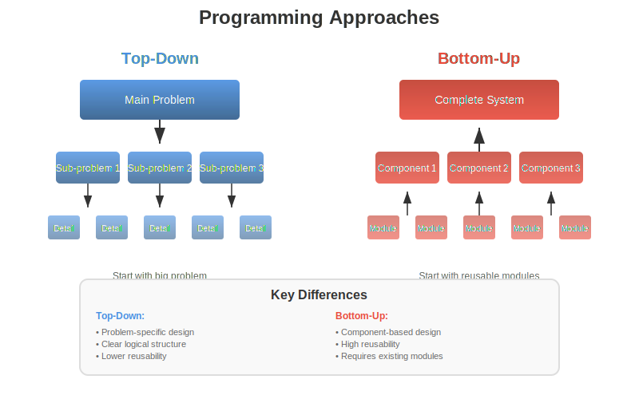
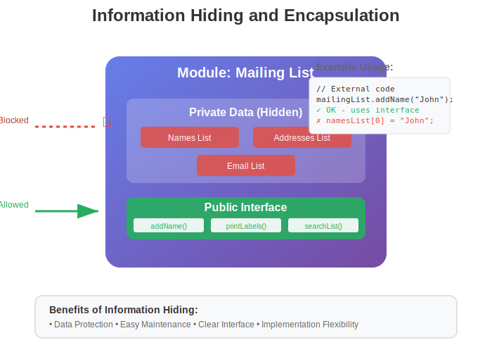
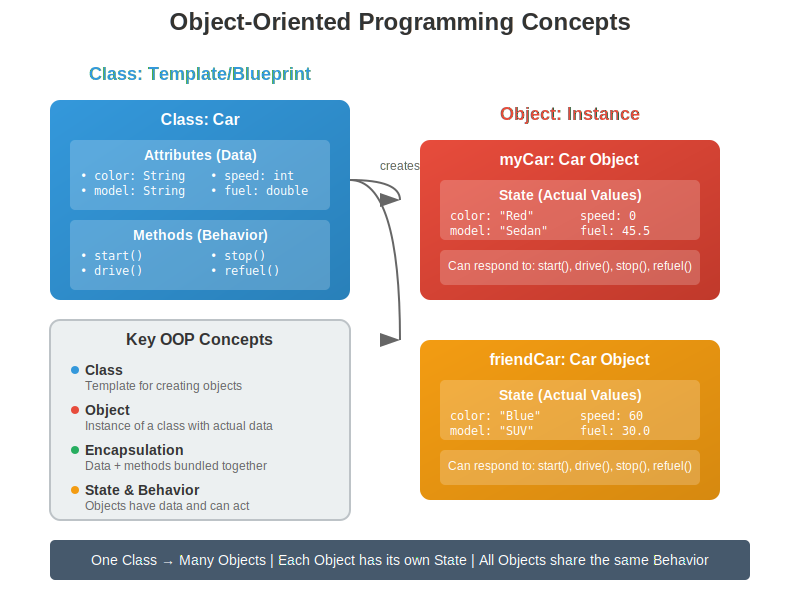
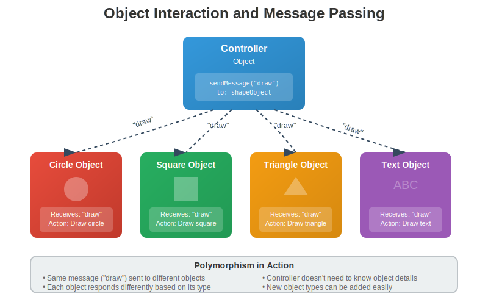
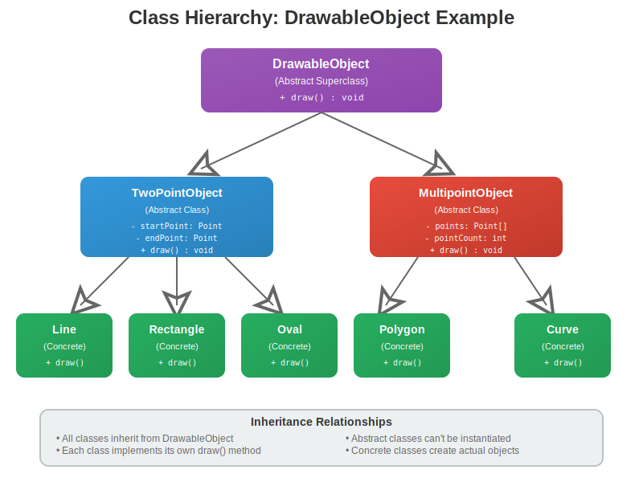

# Lesson 1.5: 객체와 객체 지향 프로그래밍 (Objects and Object-oriented Programming)

## 학습 목표
이 레슨을 마치면 다음을 할 수 있습니다:
- 소프트웨어 공학의 기본 개념 이해하기
- 탑다운과 바텀업 프로그래밍 접근법 비교하기
- 객체 지향 프로그래밍의 핵심 개념 설명하기
- 객체, 클래스, 상속의 관계 이해하기
- 정보 은닉과 모듈성의 중요성 인식하기

## 1. 소프트웨어 공학과 프로그램 설계

### 1.1 소프트웨어 공학이란?
- **정의**: 올바르고 잘 작동하는 프로그램을 체계적으로 구축하는 학문
- **목표**: 
  - 복잡한 문제를 관리 가능한 부분으로 나누기
  - 재사용 가능한 코드 작성하기
  - 유지보수가 쉬운 프로그램 만들기

### 1.2 왜 설계가 중요한가?
- 복잡한 프로그램은 한 번에 작성할 수 없음
- 체계적인 접근이 필요
- 검증된 방법론 사용으로 성공 확률 향상

## 2. 프로그래밍 접근 방법

### 2.1 탑다운 프로그래밍 (Top-down Programming)
**개념**: 큰 문제를 작은 부분으로 나누어 해결하는 방법



**특징**:
- 전체 문제에서 시작하여 세부 사항으로 진행
- 각 부분을 더 작은 하위 문제로 분할
- 구조적 프로그래밍의 핵심 방법론

**장점**:
- 논리적이고 체계적
- 문제 해결 과정이 명확
- 전체 구조를 먼저 파악 가능

**단점**:
- 데이터 구조 설계를 간과하기 쉬움
- 재사용성이 낮음
- 특정 문제에 맞춤화된 설계가 되기 쉬움

### 2.2 바텀업 프로그래밍 (Bottom-up Programming)
**개념**: 기존 구성 요소를 조합하여 전체 시스템을 구축하는 방법

**특징**:
- 재사용 가능한 구성 요소부터 시작
- 작은 모듈을 조합하여 큰 시스템 구성
- 검증된 컴포넌트 활용

**장점**:
- 코드 재사용성이 높음
- 검증된 구성 요소 사용으로 안정성 향상
- 개발 시간 단축 가능

**단점**:
- 전체 구조 파악이 어려울 수 있음
- 기존 구성 요소가 없으면 적용 어려움

## 3. 모듈과 정보 은닉

### 3.1 모듈이란?
**정의**: 시스템의 다른 부분과 잘 정의된 방식으로 상호작용하는 독립적인 구성 요소



**모듈의 특징**:
- **독립성**: 다른 모듈에 영향을 주지 않고 변경 가능
- **캡슐화**: 데이터와 관련 기능을 하나로 묶음
- **인터페이스**: 다른 모듈과 상호작용하는 명확한 방법 제공

### 3.2 정보 은닉 (Information Hiding)
**개념**: 모듈의 내부 구현을 외부에서 접근할 수 없도록 숨기는 것

**이점**:
- 데이터 보호: 잘못된 접근으로부터 데이터 보호
- 유지보수성: 내부 구현 변경이 외부에 영향을 주지 않음
- 사용 편의성: 복잡한 내부 구현을 몰라도 사용 가능

**예시: 메일링 리스트 모듈**
```
모듈: 메일링 리스트
├── 숨겨진 데이터: 이름과 주소 목록
└── 공개 인터페이스:
    ├── 새 이름 추가하기()
    ├── 메일 라벨 출력하기()
    └── 목록에서 검색하기()
```

## 4. 객체 지향 프로그래밍 (OOP)

### 4.1 OOP의 핵심 개념



**객체 (Object)**:
- 데이터(상태)와 메서드(동작)를 포함하는 독립적인 단위
- 실세계의 개념을 프로그램으로 모델링
- 메시지를 통해 다른 객체와 상호작용

**클래스 (Class)**:
- 객체를 만들기 위한 템플릿 또는 설계도
- 같은 종류의 객체들이 공유하는 속성과 메서드 정의
- 하나의 클래스로부터 여러 객체 생성 가능

**예시: 자동차 클래스와 객체**
```
클래스: 자동차
├── 속성: 색상, 모델, 연료량
└── 메서드: 시동걸기(), 운전하기(), 정지하기()

객체1: 내 자동차 (빨간색, 소나타, 50L)
객체2: 친구 자동차 (파란색, 아반떼, 30L)
```

### 4.2 메시지와 메서드
- **메시지**: 객체에게 어떤 동작을 요청하는 것
- **메서드**: 메시지에 응답하여 실행되는 코드
- 같은 메시지도 객체에 따라 다르게 처리될 수 있음



### 4.3 다형성 (Polymorphism)
**정의**: 같은 메시지에 대해 서로 다른 객체가 다르게 응답하는 능력

**예시**: "그리기" 메시지
- 원 객체 → 원을 그림
- 사각형 객체 → 사각형을 그림
- 삼각형 객체 → 삼각형을 그림

## 5. 상속과 클래스 계층구조

### 5.1 상속 (Inheritance)
**개념**: 한 클래스가 다른 클래스의 속성과 메서드를 물려받는 것



**용어**:
- **슈퍼클래스 (부모 클래스)**: 속성을 물려주는 클래스
- **서브클래스 (자식 클래스)**: 속성을 물려받는 클래스

### 5.2 상속의 이점
1. **코드 재사용**: 기존 클래스의 기능을 그대로 활용
2. **확장성**: 기존 기능에 새로운 기능 추가 가능
3. **유지보수**: 공통 기능을 한 곳에서 관리
4. **다형성 구현**: 같은 인터페이스로 다양한 구현 가능

### 5.3 그리기 프로그램 예시
```
DrawableObject (그릴 수 있는 객체)
├── TwoPointObject (두 점 객체)
│   ├── Line (선)
│   ├── Rectangle (사각형)
│   └── Oval (타원)
└── MultipointObject (다중 점 객체)
    ├── Polygon (다각형)
    └── Curve (곡선)
```

모든 하위 클래스는:
- DrawableObject의 "그리기" 기능을 상속
- 각자의 방식으로 "그리기" 메서드를 구현
- 추가적인 고유 기능을 가질 수 있음

## 6. OOP의 장점과 실제 적용

### 6.1 소프트웨어 재사용
- 클래스는 재사용 가능한 구성 요소
- 상속을 통한 기존 코드 확장
- 검증된 클래스 라이브러리 활용

### 6.2 실세계 모델링
- 현실 세계의 개념을 직관적으로 표현
- 프로그램 구조가 문제 영역과 유사
- 이해하기 쉽고 유지보수가 용이

### 6.3 팀 개발에 유리
- 명확한 인터페이스로 협업 용이
- 독립적인 모듈 개발 가능
- 테스트와 디버깅이 쉬움

## 요약

1. **소프트웨어 공학**은 체계적인 프로그램 개발 방법론을 제공합니다.

2. **탑다운과 바텀업** 접근법은 각각의 장단점이 있으며, 현대 프로그래밍에서는 두 방법을 적절히 조합하여 사용합니다.

3. **모듈과 정보 은닉**은 프로그램의 복잡성을 관리하고 유지보수를 쉽게 만듭니다.

4. **객체 지향 프로그래밍**은 데이터와 메서드를 결합한 객체를 중심으로 프로그램을 구성합니다.

5. **상속과 다형성**은 코드 재사용과 확장성을 제공하는 OOP의 핵심 기능입니다.

6. OOP는 **실세계 모델링**, **재사용성**, **유지보수성** 측면에서 큰 장점을 제공합니다.

## 다음 단계
다음 챕터에서는 Java 언어에 내장된 객체를 사용하는 방법을 배우고, 이후에는 직접 클래스와 객체를 만드는 방법을 학습할 예정입니다.