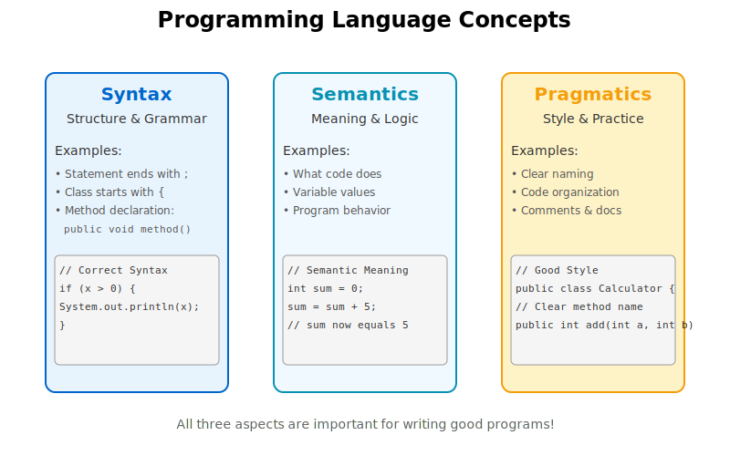
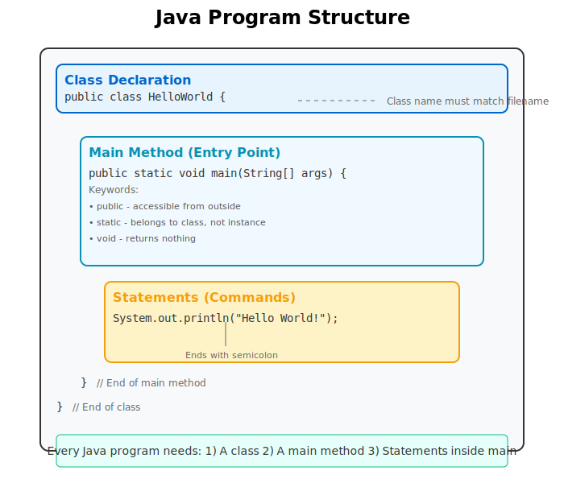
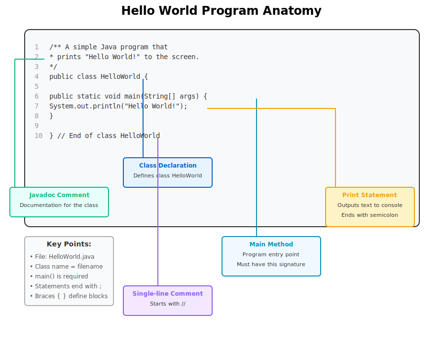
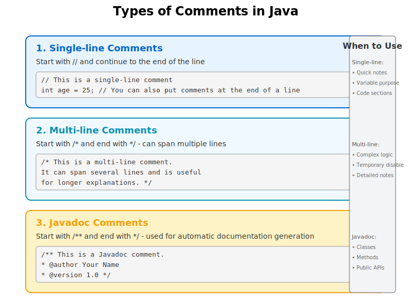
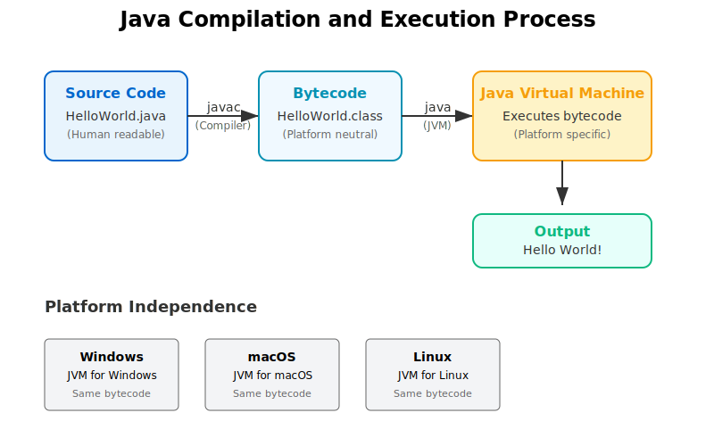

# 2.1 기본 Java 애플리케이션 - 상세 학습 자료

## 학습 목표
이 단원을 마치면 다음을 할 수 있습니다:
- 프로그래밍 언어의 구문, 의미, 실용성 개념을 이해하고 구별할 수 있습니다
- 기본 Java 프로그램의 구조를 설명할 수 있습니다
- 첫 번째 Java 프로그램(Hello World)을 작성하고 실행할 수 있습니다
- Java의 다양한 주석 유형을 이해하고 적절히 사용할 수 있습니다
- Java 컴파일 및 실행 과정을 이해할 수 있습니다

## 1. 프로그래밍 언어의 세 가지 측면



### 1.1 구문(Syntax) - 언어의 문법

**구문**은 프로그래밍 언어의 형식적인 규칙을 의미합니다. 이는 프로그램을 어떻게 작성해야 하는지를 정의합니다.

#### 주요 특징:
- **엄격한 규칙**: 한 글자라도 틀리면 컴파일 오류 발생
- **명확성**: 모호함이 없고 정확히 정의됨
- **일관성**: 모든 프로그램에 동일하게 적용

#### Java 구문 예시:
```java
// 올바른 구문
if (x > 0) {
    System.out.println("양수입니다");
}

// 잘못된 구문 - 세미콜론 누락
if (x > 0) {
    System.out.println("양수입니다")  // 오류!
}

// 잘못된 구문 - 괄호 불일치
if (x > 0 {  // 오류!
    System.out.println("양수입니다");
}
```

### 1.2 의미(Semantics) - 코드의 의미

**의미**는 구문적으로 올바른 프로그램이 실제로 무엇을 하는지를 나타냅니다.

#### 주요 특징:
- **논리적 정확성**: 원하는 결과를 생성하는가?
- **실행 시 동작**: 프로그램이 어떻게 작동하는가?
- **의도된 목적**: 프로그램이 문제를 올바르게 해결하는가?

#### 의미적 오류 예시:
```java
// 구문은 맞지만 의미가 잘못됨
int sum = 0;
for (int i = 1; i <= 10; i++) {
    sum = i;  // 누적이 아닌 대입 - 논리적 오류!
}
// sum은 10이 됨 (1부터 10까지의 합인 55가 아님)

// 올바른 의미
int sum = 0;
for (int i = 1; i <= 10; i++) {
    sum = sum + i;  // 또는 sum += i;
}
// sum은 55가 됨
```

### 1.3 실용성(Pragmatics) - 좋은 코드 작성법

**실용성**은 코드를 어떻게 잘 작성할 것인가에 관한 것입니다. 이는 스타일, 가독성, 유지보수성을 포함합니다.

#### 주요 원칙:
- **가독성**: 다른 사람(미래의 나 포함)이 쉽게 이해할 수 있는가?
- **일관성**: 코딩 스타일이 일관되는가?
- **명확성**: 변수명과 메소드명이 의미를 잘 전달하는가?
- **문서화**: 적절한 주석이 있는가?

#### 실용성 비교:
```java
// 나쁜 스타일
public class x{public static void main(String[]a){
int n=10,s=0;for(int i=1;i<=n;i++)s+=i;
System.out.println(s);}}

// 좋은 스타일
public class SumCalculator {
    public static void main(String[] args) {
        int limit = 10;
        int sum = 0;
        
        // 1부터 limit까지의 합 계산
        for (int i = 1; i <= limit; i++) {
            sum += i;
        }
        
        System.out.println("1부터 " + limit + "까지의 합: " + sum);
    }
}
```

## 2. Java 프로그램의 기본 구조



### 2.1 필수 구성 요소

모든 Java 프로그램은 다음 세 가지 요소를 반드시 포함해야 합니다:

1. **클래스(Class)**: 모든 Java 코드는 클래스 내부에 존재
2. **main 메소드**: 프로그램의 시작점
3. **문장(Statements)**: 실제 작업을 수행하는 명령어

### 2.2 기본 구조 템플릿

```java
public class 프로그램이름 {
    public static void main(String[] args) {
        // 여기에 프로그램 코드 작성
    }
}
```

### 2.3 중요한 규칙

1. **파일명 규칙**: 
   - 클래스 이름과 파일명이 정확히 일치해야 함
   - 예: `HelloWorld` 클래스는 `HelloWorld.java` 파일에 저장

2. **대소문자 구분**: 
   - Java는 대소문자를 구분함
   - `Main`과 `main`은 다른 것

3. **공백과 들여쓰기**:
   - 컴퓨터는 무시하지만 가독성에 중요
   - 일관된 들여쓰기 사용 (보통 4칸 또는 탭)

## 3. Hello World 프로그램 상세 분석



### 3.1 전체 코드

```java
/** 
 * 첫 번째 Java 프로그램
 * "Hello World!"를 화면에 출력합니다.
 */
public class HelloWorld {
    
    public static void main(String[] args) {
        System.out.println("Hello World!");
    }
    
}   // 클래스 HelloWorld의 끝
```

### 3.2 각 부분 설명

#### 1) Javadoc 주석
```java
/** 
 * 첫 번째 Java 프로그램
 * "Hello World!"를 화면에 출력합니다.
 */
```
- 프로그램 문서화를 위한 특별한 주석
- `/**`로 시작하고 `*/`로 끝남
- 자동 문서 생성 도구에서 사용

#### 2) 클래스 선언
```java
public class HelloWorld {
```
- `public`: 다른 클래스에서 접근 가능
- `class`: 클래스를 정의하는 키워드
- `HelloWorld`: 클래스 이름 (파일명과 일치해야 함)
- `{`: 클래스 본문 시작

#### 3) main 메소드
```java
public static void main(String[] args) {
```
- `public`: 외부에서 호출 가능 (JVM이 호출해야 하므로 필수)
- `static`: 객체 생성 없이 호출 가능
- `void`: 반환값이 없음
- `main`: 메소드 이름 (변경 불가)
- `String[] args`: 명령행 인자를 받는 매개변수
- `{`: 메소드 본문 시작

#### 4) 출력 문장
```java
System.out.println("Hello World!");
```
- `System`: 시스템 클래스
- `out`: 표준 출력 스트림
- `println`: 한 줄 출력 후 줄바꿈하는 메소드
- `"Hello World!"`: 출력할 문자열
- `;`: 문장의 끝을 표시 (필수!)

#### 5) 닫는 중괄호
```java
    }
}
```
- 첫 번째 `}`: main 메소드 끝
- 두 번째 `}`: HelloWorld 클래스 끝

## 4. Java 주석의 종류와 사용법



### 4.1 단일 행 주석 (Single-line Comments)

```java
// 이것은 단일 행 주석입니다
int age = 25;  // 변수 선언 옆에도 사용 가능

// 여러 줄을 주석 처리하려면
// 각 줄마다 //를 사용해야 합니다
// 이렇게 말이죠
```

**사용 시기:**
- 짧은 설명이 필요할 때
- 코드의 특정 부분을 간단히 설명할 때
- 임시로 코드를 비활성화할 때

### 4.2 다중 행 주석 (Multi-line Comments)

```java
/* 이것은 다중 행 주석입니다.
   여러 줄에 걸쳐 작성할 수 있습니다.
   긴 설명이 필요할 때 유용합니다. */

/* 
 * 별표를 사용하여
 * 보기 좋게 정렬할 수도 있습니다.
 * 이렇게 하면 가독성이 높아집니다.
 */
```

**사용 시기:**
- 복잡한 알고리즘 설명
- 여러 줄의 코드를 임시로 비활성화
- 섹션 구분이나 상세한 설명

### 4.3 Javadoc 주석 (Documentation Comments)

```java
/**
 * 이 클래스는 기본적인 계산기 기능을 제공합니다.
 * 
 * @author 홍길동
 * @version 1.0
 * @since 2024-01-01
 */
public class Calculator {
    
    /**
     * 두 정수를 더합니다.
     * 
     * @param a 첫 번째 정수
     * @param b 두 번째 정수
     * @return a와 b의 합
     */
    public int add(int a, int b) {
        return a + b;
    }
}
```

**사용 시기:**
- 클래스 설명
- 메소드 설명
- 공개 API 문서화

**Javadoc 태그:**
- `@author`: 작성자
- `@version`: 버전
- `@since`: 도입 시기
- `@param`: 매개변수 설명
- `@return`: 반환값 설명
- `@throws`: 예외 설명

## 5. Java 컴파일과 실행 과정



### 5.1 3단계 과정

#### 1단계: 소스 코드 작성
- 텍스트 에디터나 IDE를 사용하여 `.java` 파일 작성
- 예: `HelloWorld.java`

#### 2단계: 컴파일
```bash
javac HelloWorld.java
```
- `javac` 명령어로 컴파일
- `.java` 파일을 `.class` 파일(바이트코드)로 변환
- 구문 오류가 있으면 컴파일 실패

#### 3단계: 실행
```bash
java HelloWorld
```
- `java` 명령어로 실행
- JVM이 바이트코드를 해석하여 실행
- 결과가 화면에 출력됨

### 5.2 플랫폼 독립성

Java의 가장 큰 특징 중 하나는 "Write Once, Run Anywhere"입니다:

- **소스 코드**: 모든 플랫폼에서 동일
- **바이트코드**: 플랫폼 중립적인 중간 코드
- **JVM**: 각 플랫폼별로 다른 구현체
- **결과**: 동일한 바이트코드가 모든 플랫폼에서 실행

### 5.3 표준 출력 이해하기

`System.out.println()`의 출력 위치:

1. **명령줄 환경**: 터미널/콘솔 창에 직접 출력
2. **IDE 환경**: 
   - Eclipse: Console 뷰
   - IntelliJ IDEA: Run 탭
   - VS Code: Terminal 패널
3. **웹 환경**: 서버 로그 파일

## 6. 첫 프로그램 수정해보기

### 6.1 다른 메시지 출력하기

```java
public class Greeting {
    public static void main(String[] args) {
        System.out.println("안녕하세요!");
        System.out.println("Java 프로그래밍에 오신 것을 환영합니다.");
        System.out.println("프로그래밍은 재미있습니다!");
    }
}
```

### 6.2 여러 줄 출력하기

```java
public class MultiLineOutput {
    public static void main(String[] args) {
        System.out.println("첫 번째 줄");
        System.out.println("두 번째 줄");
        System.out.println();  // 빈 줄
        System.out.println("네 번째 줄");
    }
}
```

### 6.3 print vs println

```java
public class PrintComparison {
    public static void main(String[] args) {
        // println: 출력 후 줄바꿈
        System.out.println("Hello");
        System.out.println("World");
        
        // print: 줄바꿈 없이 출력
        System.out.print("Hello");
        System.out.print(" ");
        System.out.print("World");
        System.out.println();  // 줄바꿈만
    }
}
```

## 7. 자주 발생하는 오류와 해결법

### 7.1 컴파일 오류

#### 1) 세미콜론 누락
```java
// 오류
System.out.println("Hello")

// 해결
System.out.println("Hello");
```

#### 2) 대소문자 오류
```java
// 오류
system.out.println("Hello");  // system은 소문자
System.Out.println("Hello");  // Out은 대문자

// 해결
System.out.println("Hello");
```

#### 3) 괄호 불일치
```java
// 오류
public class Test {
    public static void main(String[] args) {
        System.out.println("Hello");
    // } 하나 누락

// 해결
public class Test {
    public static void main(String[] args) {
        System.out.println("Hello");
    }
}
```

#### 4) 파일명과 클래스명 불일치
```java
// Test.java 파일에 다음 코드가 있으면 오류
public class Hello {  // 클래스명이 파일명과 다름
    // ...
}

// 해결: 파일명을 Hello.java로 변경하거나
// 클래스명을 Test로 변경
```

### 7.2 실행 오류

#### 1) main 메소드 없음
```java
public class NoMain {
    public void myMethod() {
        System.out.println("Hello");
    }
}
// 오류: main method not found

// 해결: main 메소드 추가
public class NoMain {
    public static void main(String[] args) {
        System.out.println("Hello");
    }
}
```

#### 2) main 메소드 시그니처 오류
```java
// 오류: main 메소드 형식이 잘못됨
public static void Main(String[] args) {  // Main은 대문자
public void main(String[] args) {         // static 누락
public static int main(String[] args) {   // void가 아님

// 해결: 정확한 형식 사용
public static void main(String[] args) {
```

## 8. 연습 문제

### 기초 문제

1. **Hello World 변형**
   - "Hello, Java!"를 출력하는 프로그램 작성
   - 자신의 이름을 출력하는 프로그램 작성

2. **여러 줄 출력**
   - 다음과 같이 출력하는 프로그램 작성:
   ```
   *****
   *   *
   *   *
   *****
   ```

3. **주석 연습**
   - Hello World 프로그램에 세 가지 유형의 주석 모두 추가

### 도전 문제

1. **ASCII 아트**
   - 간단한 ASCII 아트를 출력하는 프로그램 작성

2. **이스케이프 문자**
   - 다음을 출력하는 프로그램 작성:
   ```
   "Hello World!"
   C:\Program Files\Java
   첫 줄
   	탭이 들어간 줄
   ```

## 9. 요약

이 단원에서 배운 내용:

1. **프로그래밍 언어의 세 가지 측면**
   - 구문(Syntax): 문법 규칙
   - 의미(Semantics): 코드의 의미
   - 실용성(Pragmatics): 좋은 코드 작성법

2. **Java 프로그램의 기본 구조**
   - 클래스 안에 모든 코드 작성
   - main 메소드가 프로그램의 시작점
   - 문장은 세미콜론으로 끝남

3. **주석의 종류와 사용법**
   - `//`: 단일 행 주석
   - `/* */`: 다중 행 주석
   - `/** */`: Javadoc 주석

4. **컴파일과 실행 과정**
   - 소스 코드(.java) → 바이트코드(.class) → 실행
   - 플랫폼 독립성의 원리

5. **첫 프로그램 작성 시 주의사항**
   - 파일명과 클래스명 일치
   - 대소문자 구분
   - 정확한 main 메소드 형식

## 10. 다음 단계

다음 섹션에서는:
- 변수와 기본 타입
- 연산자와 표현식
- 입력과 출력
- 간단한 계산 프로그램 작성

프로그래밍의 첫 걸음을 성공적으로 내디뎠습니다! 계속해서 연습하고 실험해보세요.