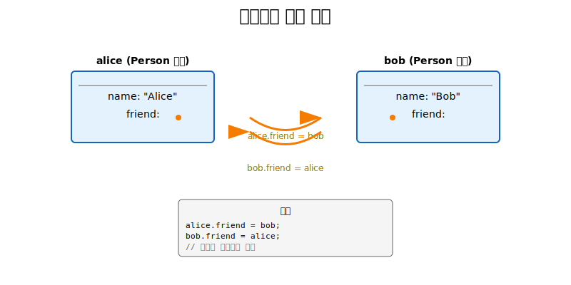
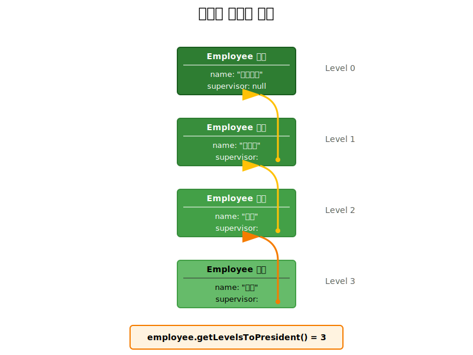
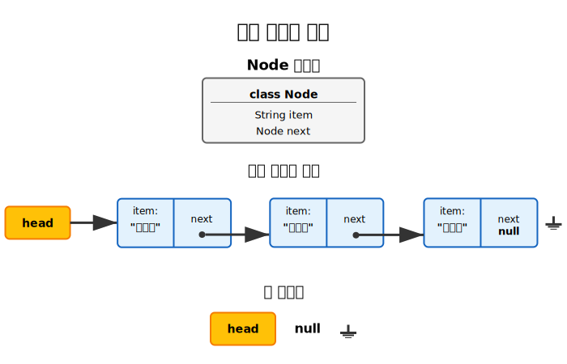
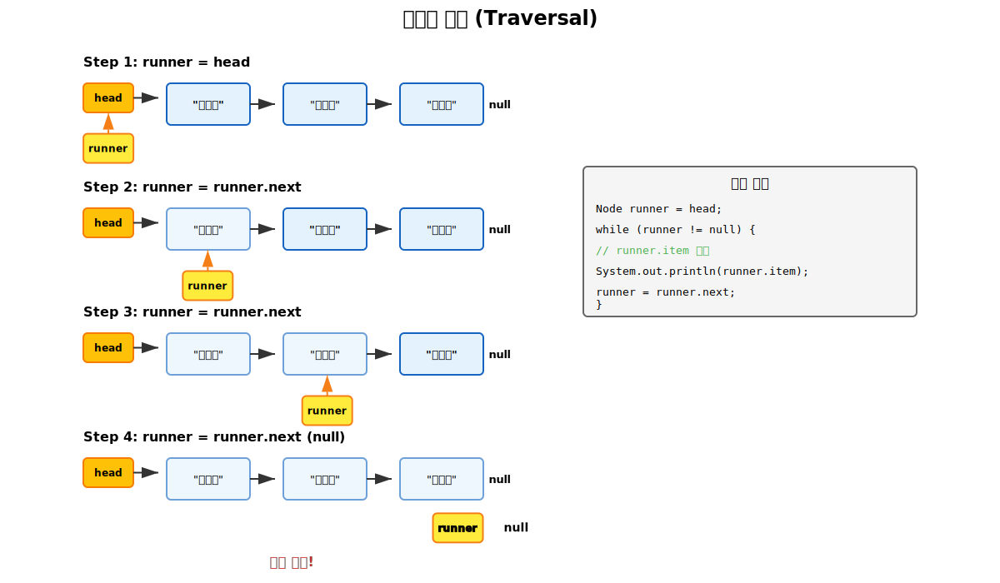
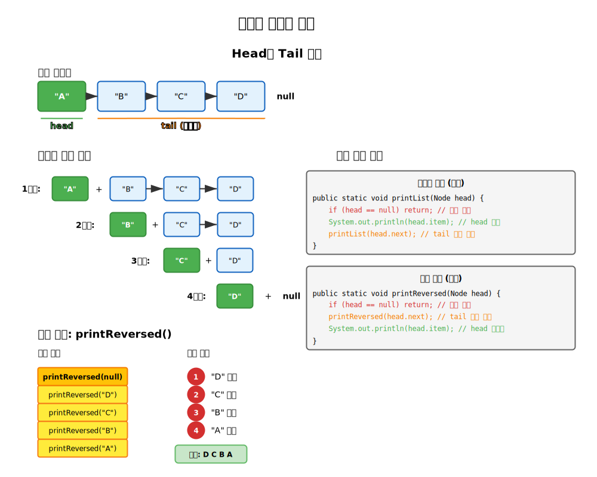
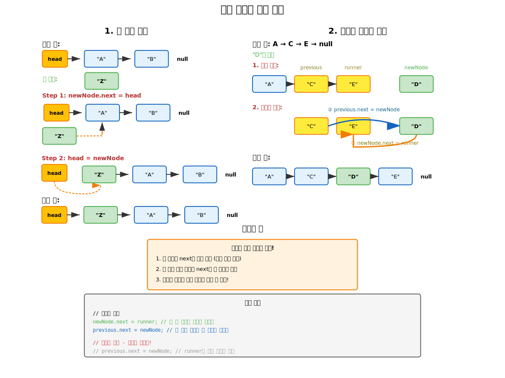

# 9.2 연결된 데이터 구조 - 학습 자료

## 학습 목표
이 장을 마치면 다음을 할 수 있습니다:
- 포인터와 참조를 사용한 객체 연결의 개념을 이해한다
- 연결 리스트의 구조와 동작 원리를 설명한다
- 연결 리스트의 기본 연산(순회, 검색, 삽입, 삭제)을 구현한다
- 재귀적 데이터 구조의 특징을 이해하고 활용한다
- 포인터 조작의 세부사항을 정확히 이해하고 디버깅할 수 있다

## 1. 연결된 데이터 구조란?

### 1.1 포인터와 객체 연결



Java에서 객체는 다른 객체에 대한 **참조(reference)** 를 가질 수 있습니다. 이러한 참조를 **포인터(pointer)** 라고도 합니다.

```java
public class Person {
    String name;
    Person friend;  // 다른 Person 객체를 가리킬 수 있음
}

// 사용 예시
Person alice = new Person();
alice.name = "Alice";

Person bob = new Person();
bob.name = "Bob";

alice.friend = bob;  // Alice가 Bob을 가리킴
bob.friend = alice;  // Bob이 Alice를 가리킴
```

### 1.2 재귀적 클래스 정의



클래스가 자기 자신의 타입을 인스턴스 변수로 가질 때, 이를 **재귀적 클래스 정의**라고 합니다:

```java
public class Employee {
    String name;
    Employee supervisor;  // 감독자도 Employee 타입

    public Employee(String name) {
        this.name = name;
    }

    // 감독자 체인을 따라 사장까지의 거리 계산
    public int getLevelsToPresident() {
        if (supervisor == null) {
            return 0;  // 이 사람이 사장
        }

        int count = 0;
        Employee current = this;

        while (current.supervisor != null) {
            count++;
            current = current.supervisor;
        }

        return count;
    }
}
```

### 1.3 연결된 구조의 예시

```java
// 직원 조직도 예시
Employee president = new Employee("대표이사");
Employee vp = new Employee("부사장");
Employee manager = new Employee("부장");
Employee employee = new Employee("사원");

// 감독자 관계 설정
employee.supervisor = manager;
manager.supervisor = vp;
vp.supervisor = president;
president.supervisor = null;  // 사장은 감독자 없음

// 사원에서 사장까지의 단계 수
System.out.println(employee.getLevelsToPresident());  // 3
```

## 2. 연결 리스트(Linked List)



### 2.1 노드(Node) 클래스

연결 리스트의 기본 구성 요소는 **노드**입니다:

```java
class Node {
    String item;   // 저장할 데이터
    Node next;     // 다음 노드를 가리키는 포인터

    // 생성자
    public Node(String item) {
        this.item = item;
        this.next = null;  // 초기값은 null
    }
}
```

### 2.2 연결 리스트의 구조

```java
// 연결 리스트 만들기
Node first = new Node("첫번째");
Node second = new Node("두번째");
Node third = new Node("세번째");

// 노드들을 연결
first.next = second;
second.next = third;
third.next = null;  // 마지막 노드

// head 변수로 리스트의 시작 지점 표시
Node head = first;
```

**시각적 표현:**
```
head → [첫번째|next] → [두번째|next] → [세번째|null]
```

### 2.3 빈 리스트

빈 리스트는 `head`가 `null`인 경우입니다:

```java
Node head = null;  // 빈 리스트
```

## 3. 연결 리스트의 기본 연산

### 3.1 리스트 순회(Traversal)



연결 리스트의 모든 요소를 방문하는 기본 패턴:

```java
public class LinkedListTraversal {

    // 리스트의 모든 항목 출력
    public static void printList(Node head) {
        Node runner = head;

        while (runner != null) {
            System.out.println(runner.item);
            runner = runner.next;
        }
    }

    // for 루프를 사용한 버전
    public static void printListWithFor(Node head) {
        for (Node runner = head; runner != null; runner = runner.next) {
            System.out.println(runner.item);
        }
    }

    // 리스트의 길이 계산
    public static int getLength(Node head) {
        int count = 0;
        Node runner = head;

        while (runner != null) {
            count++;
            runner = runner.next;
        }

        return count;
    }
}
```

### 3.2 재귀적 리스트 처리



연결 리스트는 재귀적으로도 처리할 수 있습니다:

```java
public class RecursiveListOperations {

    // 재귀적으로 리스트 출력
    public static void printListRecursive(Node head) {
        if (head == null) {
            return;  // 기저 사례
        }

        System.out.println(head.item);
        printListRecursive(head.next);  // 재귀 호출
    }

    // 역순으로 출력 (재귀의 장점!)
    public static void printReversed(Node head) {
        if (head == null) {
            return;
        }

        // 먼저 나머지를 역순으로 출력
        printReversed(head.next);

        // 그 다음 현재 항목 출력
        System.out.println(head.item);
    }

    // 재귀적으로 리스트 길이 계산
    public static int getLengthRecursive(Node head) {
        if (head == null) {
            return 0;
        }
        return 1 + getLengthRecursive(head.next);
    }
}
```

### 3.3 정수 연결 리스트

다른 타입의 데이터를 저장하는 연결 리스트:

```java
class IntNode {
    int item;
    IntNode next;

    public IntNode(int item) {
        this.item = item;
        this.next = null;
    }
}

public class IntLinkedListOperations {

    // 리스트의 합계 계산 (반복)
    public static int sumIterative(IntNode head) {
        int sum = 0;
        IntNode runner = head;

        while (runner != null) {
            sum += runner.item;
            runner = runner.next;
        }

        return sum;
    }

    // 리스트의 합계 계산 (재귀)
    public static int sumRecursive(IntNode head) {
        if (head == null) {
            return 0;
        }
        return head.item + sumRecursive(head.next);
    }

    // 최댓값 찾기
    public static int findMax(IntNode head) {
        if (head == null) {
            throw new IllegalArgumentException("빈 리스트입니다");
        }

        int max = head.item;
        IntNode runner = head.next;

        while (runner != null) {
            if (runner.item > max) {
                max = runner.item;
            }
            runner = runner.next;
        }

        return max;
    }
}
```

## 4. StringList 클래스

더 체계적인 연결 리스트 구현:

```java
public class StringList {

    private Node head;  // 리스트의 첫 번째 노드

    // 중첩 클래스로 Node 정의
    private static class Node {
        String item;
        Node next;

        Node(String item) {
            this.item = item;
            this.next = null;
        }
    }

    // 생성자
    public StringList() {
        head = null;  // 빈 리스트로 시작
    }

    // 리스트가 비어있는지 확인
    public boolean isEmpty() {
        return head == null;
    }

    // 리스트의 크기
    public int size() {
        int count = 0;
        Node runner = head;

        while (runner != null) {
            count++;
            runner = runner.next;
        }

        return count;
    }

    // 리스트 출력
    public void printList() {
        if (isEmpty()) {
            System.out.println("리스트가 비어있습니다.");
            return;
        }

        System.out.print("리스트: ");
        Node runner = head;

        while (runner != null) {
            System.out.print(runner.item);
            if (runner.next != null) {
                System.out.print(" → ");
            }
            runner = runner.next;
        }
        System.out.println();
    }
}
```

### 4.1 검색 연산

리스트에서 특정 항목을 찾기:

```java
public boolean find(String searchItem) {
    Node runner = head;

    while (runner != null) {
        if (runner.item.equals(searchItem)) {
            return true;  // 찾음!
        }
        runner = runner.next;
    }

    return false;  // 찾지 못함
}

// 항목의 위치 찾기 (0부터 시작)
public int indexOf(String searchItem) {
    Node runner = head;
    int position = 0;

    while (runner != null) {
        if (runner.item.equals(searchItem)) {
            return position;
        }
        runner = runner.next;
        position++;
    }

    return -1;  // 찾지 못함
}
```

## 5. 연결 리스트에 삽입하기

### 5.1 맨 앞에 삽입

가장 간단한 삽입 방법:

```java
public void insertAtFront(String newItem) {
    Node newNode = new Node(newItem);
    newNode.next = head;  // 새 노드가 기존 첫 번째 노드를 가리킴
    head = newNode;       // head가 새 노드를 가리킴
}
```

### 5.2 맨 끝에 삽입

리스트의 끝을 찾아서 삽입:

```java
public void insertAtEnd(String newItem) {
    Node newNode = new Node(newItem);

    if (head == null) {
        // 빈 리스트인 경우
        head = newNode;
        return;
    }

    // 마지막 노드 찾기
    Node runner = head;
    while (runner.next != null) {
        runner = runner.next;
    }

    // 마지막 노드 뒤에 새 노드 연결
    runner.next = newNode;
}
```

### 5.3 정렬된 순서로 삽입

리스트를 정렬된 상태로 유지하면서 삽입:

```java
public void insertInOrder(String newItem) {
    Node newNode = new Node(newItem);

    // 케이스 1: 빈 리스트
    if (head == null) {
        head = newNode;
        return;
    }

    // 케이스 2: 맨 앞에 삽입해야 하는 경우
    if (head.item.compareTo(newItem) >= 0) {
        newNode.next = head;
        head = newNode;
        return;
    }

    // 케이스 3: 중간이나 끝에 삽입
    Node runner = head.next;
    Node previous = head;

    // 삽입 위치 찾기
    while (runner != null && runner.item.compareTo(newItem) < 0) {
        previous = runner;
        runner = runner.next;
    }

    // previous와 runner 사이에 삽입
    newNode.next = runner;
    previous.next = newNode;
}
```

### 5.4 삽입 과정 시각화



```
삽입 전: A → C → E → null
"D" 삽입하기

1. 위치 찾기:
   previous → C
   runner → E

2. 포인터 조정:
   newNode(D).next = runner(E)
   previous(C).next = newNode(D)

삽입 후: A → C → D → E → null
```

## 6. 연결 리스트에서 삭제하기

### 6.1 특정 항목 삭제

```java
public boolean delete(String deleteItem) {
    // 케이스 1: 빈 리스트
    if (head == null) {
        return false;
    }

    // 케이스 2: 첫 번째 항목 삭제
    if (head.item.equals(deleteItem)) {
        head = head.next;
        return true;
    }

    // 케이스 3: 중간이나 끝의 항목 삭제
    Node runner = head.next;
    Node previous = head;

    while (runner != null) {
        if (runner.item.equals(deleteItem)) {
            // runner가 가리키는 노드 삭제
            previous.next = runner.next;
            return true;
        }
        previous = runner;
        runner = runner.next;
    }

    return false;  // 항목을 찾지 못함
}
```

### 6.2 인덱스로 삭제

```java
public boolean deleteAt(int index) {
    if (index < 0 || head == null) {
        return false;
    }

    // 첫 번째 항목 삭제
    if (index == 0) {
        head = head.next;
        return true;
    }

    // 지정된 인덱스까지 이동
    Node runner = head;
    Node previous = null;

    for (int i = 0; i < index && runner != null; i++) {
        previous = runner;
        runner = runner.next;
    }

    // 인덱스가 범위를 벗어남
    if (runner == null) {
        return false;
    }

    // runner가 가리키는 노드 삭제
    previous.next = runner.next;
    return true;
}
```

### 6.3 모든 항목 삭제 (리스트 비우기)

```java
public void clear() {
    head = null;  // 모든 노드가 가비지 컬렉션됨
}
```

## 7. 고급 연결 리스트 연산

### 7.1 리스트 뒤집기

```java
public void reverse() {
    Node previous = null;
    Node current = head;
    Node next = null;

    while (current != null) {
        // 다음 노드 저장
        next = current.next;

        // 현재 노드의 포인터 반전
        current.next = previous;

        // 한 칸씩 이동
        previous = current;
        current = next;
    }

    head = previous;
}
```

### 7.2 중복 제거

```java
public void removeDuplicates() {
    if (head == null) return;

    Node current = head;

    while (current != null) {
        Node runner = current;

        // current 이후의 모든 중복 제거
        while (runner.next != null) {
            if (runner.next.item.equals(current.item)) {
                runner.next = runner.next.next;
            } else {
                runner = runner.next;
            }
        }

        current = current.next;
    }
}
```

### 7.3 두 리스트 병합

```java
public static StringList merge(StringList list1, StringList list2) {
    StringList result = new StringList();
    Node runner1 = list1.head;
    Node runner2 = list2.head;

    // 두 리스트를 정렬된 순서로 병합
    while (runner1 != null && runner2 != null) {
        if (runner1.item.compareTo(runner2.item) <= 0) {
            result.insertAtEnd(runner1.item);
            runner1 = runner1.next;
        } else {
            result.insertAtEnd(runner2.item);
            runner2 = runner2.next;
        }
    }

    // 남은 요소들 추가
    while (runner1 != null) {
        result.insertAtEnd(runner1.item);
        runner1 = runner1.next;
    }

    while (runner2 != null) {
        result.insertAtEnd(runner2.item);
        runner2 = runner2.next;
    }

    return result;
}
```

## 8. 연결 리스트 vs 배열

### 8.1 장단점 비교

**연결 리스트의 장점:**
- 동적 크기 조정이 쉬움
- 삽입/삭제가 O(1) (위치를 알고 있을 때)
- 메모리를 필요한 만큼만 사용

**연결 리스트의 단점:**
- 임의 접근이 불가능 (인덱스로 직접 접근 불가)
- 포인터를 위한 추가 메모리 필요
- 캐시 지역성이 나쁨

**배열의 장점:**
- 임의 접근 가능 O(1)
- 메모리가 연속적으로 배치되어 캐시 효율적
- 포인터 오버헤드 없음

**배열의 단점:**
- 크기가 고정됨
- 중간 삽입/삭제가 O(n)
- 미리 크기를 예측해야 함

### 8.2 언제 무엇을 사용할까?

**연결 리스트를 사용하면 좋은 경우:**
- 크기가 자주 변하는 경우
- 맨 앞에서 삽입/삭제가 빈번한 경우
- 데이터의 최대 크기를 예측하기 어려운 경우

**배열을 사용하면 좋은 경우:**
- 크기가 고정적인 경우
- 인덱스로 자주 접근하는 경우
- 성능이 중요한 경우

## 9. 디버깅 팁

### 9.1 일반적인 실수들

1. **null 포인터 예외**
```java
// 잘못된 코드
Node runner = head;
runner = runner.next;  // head가 null이면 오류!

// 올바른 코드
if (head != null) {
    Node runner = head;
    runner = runner.next;
}
```

2. **무한 루프**
```java
// 잘못된 코드
while (runner != null) {
    // runner = runner.next; 를 빼먹음!
}

// 올바른 코드
while (runner != null) {
    // 처리...
    runner = runner.next;
}
```

3. **연결 끊김**
```java
// 잘못된 코드 (순서 주의!)
previous.next = newNode;
newNode.next = runner;  // 이미 연결이 끊어진 상태

// 올바른 코드
newNode.next = runner;
previous.next = newNode;
```

### 9.2 디버깅 메서드

```java
// 리스트 상태를 자세히 출력
public void debugPrint() {
    System.out.println("=== 리스트 디버그 정보 ===");
    System.out.println("head: " + (head == null ? "null" : head.item));

    Node runner = head;
    int index = 0;

    while (runner != null) {
        System.out.printf("[%d] %s → %s%n",
            index,
            runner.item,
            runner.next == null ? "null" : runner.next.item
        );
        runner = runner.next;
        index++;
    }
    System.out.println("총 노드 수: " + index);
}
```

## 마무리

연결 리스트는 컴퓨터 과학의 기본적이면서도 중요한 자료구조입니다. 핵심은:

1. **포인터 조작의 정확성**: 순서와 null 체크가 중요
2. **특별한 경우 처리**: 빈 리스트, 첫 번째/마지막 노드
3. **메모리 관리**: Java의 가비지 컬렉션이 자동으로 처리
4. **재귀적 사고**: 리스트의 재귀적 특성 활용

연결 리스트를 마스터하면 트리, 그래프 등 더 복잡한 자료구조를 이해하는 기초가 됩니다.